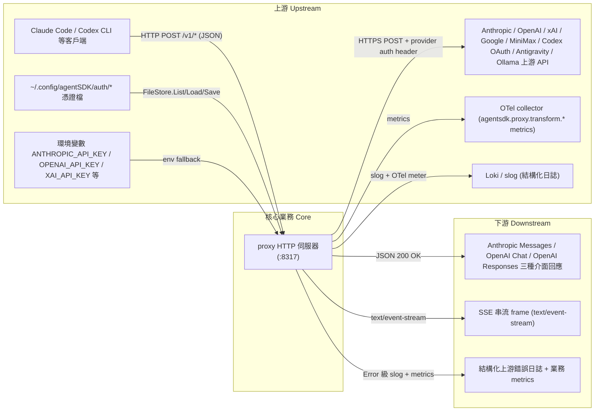
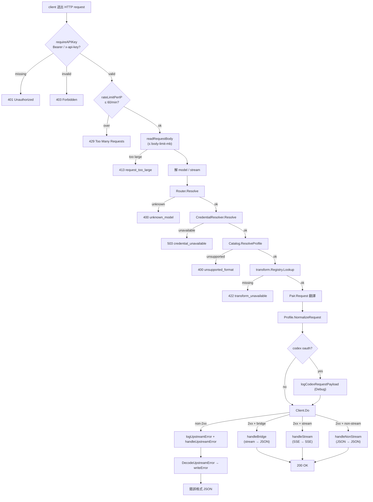
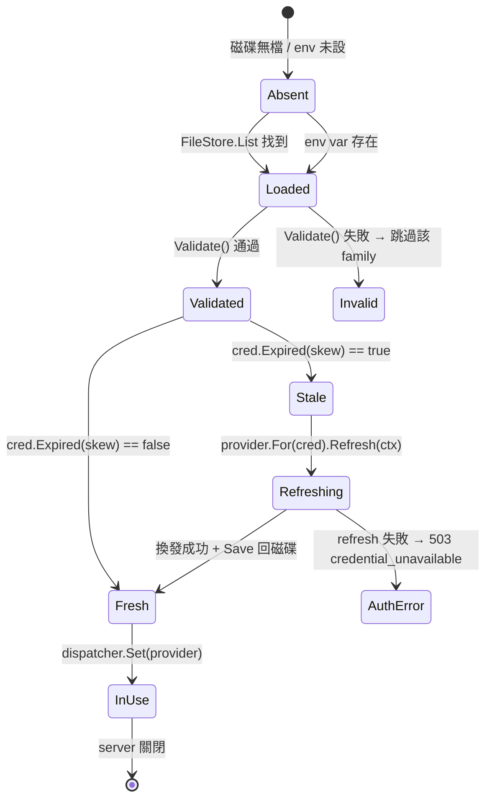

# proxy — 業務分析 (Business Analysis)

## 業務目的 (Purpose)

`proxy` 是給 LLM CLI 工具 (Claude Code、Codex CLI、以及任何相容 OpenAI/Anthropic 介面的客戶端) 使用的單機 LLM API 閘道代理。它讓使用者能用同一組 API key 與 OAuth 登入狀態，把不同供應商 (Anthropic / OpenAI / xAI / Google Gemini / MiniMax / Codex OAuth / Antigravity / Ollama) 的模型暴露為三種業界標準介面 (Anthropic Messages、OpenAI Chat Completions、OpenAI Responses)，客戶端可以「指 model 名」或「加 provider qualifier」就能路由到對應供應商，而**不需要在客戶端做格式轉換**，也**不需要為每家供應商維護各自的 key**。

## 常見業務操作 (Common Operations)

- 開發者啟動 proxy (`pm2 start` 或 `go run ./...`)，把 client 的 `*_BASE_URL` 指到 `http://localhost:8317`
- 開發者透過 `auth login --provider X` 把多組 OAuth/API-key 憑證寫入 `~/.config/agentSDK/auth/`；proxy 在啟動時自動載入所有家族的憑證並註冊到 dispatcher
- 開發者在 Claude Code 對話中送出 `claude-3-5-sonnet-20240620` → proxy 解析成 anthropic → 直接代理；改送 `openai/gpt-4o` → proxy 解析成 openai 並轉譯為 Chat Completions → 經 OpenAI 認證送出
- 開發者要求串流 (`"stream": true`) 時收到 SSE 事件流；要求非串流但上游只支援串流 (例如 Codex OAuth 強制 `stream: true`) 時，proxy 自動 bridge 並回 JSON
- 開發者讀取 `/v1/models` 拿到目前 dispatcher 中所有 provider 的 catalog 合併模型清單
- 開發者透過 `/v1/messages/count_tokens` 取得 Anthropic 原生 token 計數 (僅當目標 provider 有 `CountTokensEndpoint`)

## 上下游服務 (Upstream / Downstream)

## 狀態與流程 (Status / Flow)

一個請求從進入到結束經過的生命週期：

業務物件的生命週期 (OAuth 憑證)：

## 業務約束 (Constraints)

- 准入/品質門檻：
    - `api-keys` 為空時自動產生一把 `sk-...` (32 bytes hex)，首次啟動即可用 (僅記憶體，不持久化)
    - 每個 provider 必須有至少一種 auth path (api_key 或 oauth)；缺哪種就在該 family 從 dispatcher 移除
- 去重/冪等規則：
    - `Router.Resolve` 命中多個 provider 時直接回 `unknown_model` (fail-closed)；避免歧義路由
    - `Dispatcher.Set` 不允許同 ID 註冊兩次
    - `transform.Registry.NewRegistry` 必須完整填滿 `model.ALL_FORMATS × ALL_FORMATS` 矩陣，缺一對就 error
- 時效/保留政策：
    - OAuth 過期 skew 由 `auth/svc.Resolver` 決定，proxy 端不另外保留
    - 單請求 body 上限 `body-limit-mb` (預設 200 MB)；SSE frame 上限 1 MiB；上游錯誤 body 日誌上限 64 KiB
    - HTTP server `WriteTimeout: 0` (SSE 不可被切斷)；graceful shutdown `SHUTDOWN_TIMEOUT = 10s`
- 額度/頻率限制：
    - per-IP 60 requests / 1 min (固定窗口 in-memory mutex)；超限回 429
- 安全/隱私：
    - `sensitiveHeaders` deny-list 8 個 key (`authorization` / `proxy-authorization` / `cookie` / `set-cookie` / `x-api-key` / `api-key` / `x-auth-token` / `x-amz-security-token`) 永不寫進錯誤日誌
    - `sensitiveHeader()` 額外阻擋 hop-by-hop header (`host` / `connection` / `keep-alive` / `te` / `trailer` / `transfer-encoding` / `upgrade` / `proxy-authenticate` / `proxy-authorization`) 與所有 `x-forwarded-*`
    - Codex OAuth payload log 只記 model/stream/store/instructions_bytes/has_instructions/input_roles/tool_names/parallel_tool_calls，原始 `instructions`、`input[].content`、`tools[].parameters` 永不進日誌
    - API key 比對使用 `subtle.ConstantTimeCompare` 防 timing oracle
    - `corsLocalhost` 限制瀏覽器 CORS 只能從 `localhost` / `127.0.0.1` 來
- 路由保留政策：
    - `BuildProvider` 對未支援 family 直接 error (fail-closed)；`newDispatcherWithAuth` 對單一 family 失敗採 continue，不讓整個 dispatcher 掛掉
- 介面契約：
    - 公開介面僅 4 條 (`/v1/models` / `/v1/chat/completions` / `/v1/responses` / `/v1/messages`)，加 1 條 `count_tokens`；admin 端點 3 條皆 501 (`/admin/accounts` / `/admin/stats` / `/admin/reload`)

## 風險偵測 (Risk Detection)

| 風險類別                 | 檢查重點                                                                                              |
| :----------------------- | :---------------------------------------------------------------------------------------------------- |
| 身分/合規 (KYC/AML)      | 不適用 — 系統僅代理 LLM API 請求，不處理任何身分驗證、KYC、AML、或金融交易                          |
| 隱私 (Privacy)           | 有處理 — Codex OAuth payload 脫敏機制、`sensitiveHeaders` deny-list、絕不寫 user 內容到日誌；但 `logUpstreamError` 寫上游錯誤 body 內容 (64 KiB 截斷)，若上游把 user prompt 回在錯誤訊息裡會被印出 |
| 資料完整性               | 有處理 — body size 上限、SSE frame size 上限、stream 終止 frame、`MaxBytesReader`、`boundedStreamCollector`、route 命中唯一性檢查；但 dispatcher 與 catalog 並存可能造成 `/v1/models` 顯示的清單與實際可路由的 family 不一致 |
| 依賴風險                 | 有處理 — OAuth 換發失敗時回 503 而非 panic、env fallback 提供單 family degraded mode、gin Recovery middleware 兜底 panic；但 7 家上游 provider 任意一家 5xx 都會回 502，整體可用性 = min(各家) |

## 核心業務 (Core Business)

- **多供應商協議轉譯 (`svc/transform/*`)**：3 種 wire format × 3 種 = 9 對 Pair (含 3 個 identity)，每對含 Request/Response/Stream 三方向，是 proxy 的存在理由
- **模型路由 (`svc/route/*`)**：把 `claude-3-5-sonnet-20240620` / `openai/gpt-4o` / `grok-2` 等模型名解到 provider family，決定送往哪家
- **多憑證 OAuth 換發 (`svc/upstream/credential.go` + `dispatcher_oauth.go`)**：依 family 載入 FileStore/env 憑證，OAuth 過期自動 refresh 並存回磁碟
- **上游請求 transport (`svc/upstream/client.go` + `Profile.NormalizeRequest`)**：構造 URL、套用 auth header、Codex/xAI 專屬請求修正

## 非核心業務 (Non-core Business)

- **HTTP 表面與中介層 (`handlers/server.go` / `middleware.go` / `observability.go`)**：組 gin engine、API key 認證、CORS、rate limit、OTel counters — 沒有它 proxy 不能運作，但只是接入層 (支撐核心)
- **結構化日誌 (`handlers/codex_log.go` / `upstream_error_log.go`)**：把上游錯誤、codex 脫敏 metadata、stream 終止原因寫進 slog；不含商業邏輯但是營運必要的可觀測性 (支撐核心 — 沒有它無法在 production debug)
- **設定載入 (`config/config.go` + `cmd/proxy.go` + `main.go`)**：viper 設定合併、預設值、cobra CLI、graceful shutdown — 不產生收入但是啟動必要 (支撐核心)
- **SSE decoder (`model/sse.go`)**：bounded SSE 解析 + 寫出，是 streaming 路徑的工具層 (支撐核心)
- **錯誤模型 (`model/error.go`)**：`ProxyError` 統一錯誤型別 + 依 source format 編碼，是 cross-cutting concern (支撐核心 — 三個領域都要用)