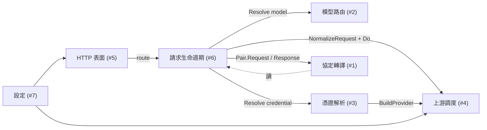

# proxy — 通用 LLM 協定轉譯代理 (Generic LLM Protocol Translation Proxy)

`proxy` 是一個通用的 LLM API 轉譯代理伺服器。它在客戶端 CLI (例如 Claude Code、Codex CLI) 與上游 LLM 提供者 (Anthropic、OpenAI、xAI、Google Gemini、MiniMax、Codex OAuth、Antigravity、Ollama) 之間居中：接收一種協定格式 (Anthropic Messages / OpenAI Chat Completions / OpenAI Responses)、依模型名稱路由到對應上游、把請求翻譯成上游原生協定 (含必要的 header/auth 規範化)、回程再翻譯回客戶端期待的格式 (含 SSE 串流)。

它同時具備**多帳號 OAuth 登入狀態的代理轉發**能力：`auth login --provider X` 寫入的憑證由 `proxy` 在每次請求時讀取、過期自動換發，並依 credentials 自動選擇 api-key 或 OAuth 模式。

---

## 業務領域 (Business Domains)

### 1. 協定轉譯 (Protocol Translation)

在 Anthropic Messages、OpenAI Chat Completions、OpenAI Responses 三種 LLM 線上格式之間做雙向轉譯，涵蓋非串流 JSON 與 SSE 串流。

`領域流程 (Domain Flow):`

1. `Handler.Handle(format)` 從 `transform.Registry.Lookup(format, targetFormat)` 取得對應的 `Pair`
2. 請求方向：`Pair.Request(ctx, RequestEnvelope)` 解碼來源 JSON、轉換欄位、編碼目標 JSON
3. 回應方向：`Pair.Response(ctx, ResponseEnvelope)` 解碼目標 JSON、轉換欄位、編碼來源 JSON
4. 串流方向：`Pair.NewStream(exchange)` 產生 `StreamTransform`，每個上游 SSE frame 進 `Push`、出一組來源格式 frame；`Close` 收尾
5. 當 client 要求非串流但上游只能串流 (例如 Codex OAuth) 時，啟動 `handleBridge`：用 `StreamCollector` 把整段串流摺成 JSON 回應

`核心實體 (Key Entities):` `Pair`, `RequestEnvelope`, `ResponseEnvelope`, `StreamTransform`, `StreamCollector`, `SSEFrame`, `Warning`, `SemanticLoss`

`相關處理器 (Related Handlers):` `svc/transform/registry.go`, `svc/transform/default.go`, `svc/transform/identity.go`, `svc/transform/response.go`, `svc/transform/collector.go`, `svc/transform/*_request.go`, `svc/transform/*_stream.go`

---

### 2. 模型路由 (Model Routing)

依客戶端送出的模型名稱，決定該請求要送給哪一家上游 provider family (anthropic / openai / xai / google / minimax) 以及要強制使用哪一種目標格式。

`領域流程 (Domain Flow):`

1. `Router.Resolve(format, modelName)` 檢查模型字串
2. 若帶 `/` 形式 (`provider/model` 或 `provider-chat/model`)，對應到 `qualifier` 並剝離前綴為 `routed_model`；`*-chat` 結尾強制 target = `FORMAT_OPENAI_CHAT`
3. 否則依序比對 `ExactModels`、再比對 `Prefixes`，必須恰好命中一家，否則視為 `unknown_model`
4. 結果傳給 `Catalog.ResolveProfile` 解析成具體 `Profile` (含 endpoint、auth scheme、header allowlist、normalizer)

`核心實體 (Key Entities):` `route.Profile`, `Route`, `Router`, `Profile`, `Catalog`

`相關處理器 (Related Handlers):` `svc/route/router.go`, `svc/route/profile.go`, `svc/upstream/profile.go` (`ResolveProfile` / `NewRouter` / `DefaultCatalog`)

---

### 3. 憑證解析 (Credential Resolution)

從檔案儲存或環境變數挑選 provider family 對應的憑證，OAuth 過期時自動換發，並把憑證映射為 live `core.Provider` 物件供 dispatcher 使用。

`領域流程 (Domain Flow):`

1. `CredentialResolver.Resolve(ctx, family)` 委託 `auth/svc.Resolver`：優先從 `cfg.AuthDir` (`utils.NewFileStore`) 讀取，否則走 env fallback (`svc.EnvLookup`)
2. OAuth 模式下 `provider.For(cred).Refresh()` 在過期或即將過期時換發新 token 並 `Save` 回磁碟
3. dispatcher 端：`BuildProvider(cred)` 依 `cred.Kind` 分流到 `buildAPIKeyProvider` 或 `buildOAuthProvider`，把通用 `authmodel.Credential` 映射為該 provider 的 `WithAPIKey` 或 `NewWithOAuth` 構造參數
4. 結果是一個 `core.Provider` 實例，登錄到 `Dispatcher` 供後續請求使用

`核心實體 (Key Entities):` `authmodel.Credential`, `authmodel.Kind` (api_key / oauth), `CredentialResolver`, `core.Provider`, `auth/svc.Resolver`

`相關處理器 (Related Handlers):` `svc/upstream/credential.go`, `svc/upstream/dispatcher_oauth.go` (`BuildProvider`, `NewDispatcherWithAuth`, `NewDispatcherWithAuthAndEnv`), `handlers/server.go` (FileStore 組裝)

---

### 4. 上游調度 (Upstream Provider Dispatch)

封裝每一家上游 provider 的「連線目標 + 認證形式 + 請求規範化」，並管理運行期 `core.Provider` 物件集合。

`領域流程 (Domain Flow):`

1. 啟動時 `DefaultCatalog()` 載入 6 個 `Profile` (anthropic / minimax / openai-api / openai-codex-oauth / xai / google)，每個含 endpoint map、auth scheme、header allowlist、`AdvertisedModels`、選填的 `NormalizeRequest`
2. `Client.do(...)` 依 profile + credential 構造 HTTP request、套用 allowlist 過濾 header、注入 `x-api-key` / `Authorization`、必要時加 `anthropic-version` / codex 的 `originator`、`version`、`User-Agent`、`ChatGPT-Account-ID`
3. `Profile.NormalizeRequest(envelope)` 在轉譯完成後執行：例如 `normalizeCodexRequest` 把 `instructions` 從 system/developer 訊息裡 lift 出來、刪除 `max_output_tokens`、強制 `stream: true`；`normalizeXAIRequest` 拒絕非 function 類型 tool
4. `Dispatcher.Lookup(family)` 提供 `/v1/models` 端點的 `AdvertisedModels` 來源

`核心實體 (Key Entities):` `Profile`, `Catalog`, `Dispatcher`, `NormalizeRequest`, `NormalizedRequest`

`相關處理器 (Related Handlers):` `svc/upstream/profile.go`, `svc/upstream/dispatcher.go`, `svc/upstream/dispatcher_default.go`, `svc/upstream/client.go`

---

### 5. HTTP 公開介面與中介層 (HTTP Surface & Middleware)

把代理伺服器的 HTTP 表面組裝起來：路由表、認證、CORS、rate limit、metrics。

`領域流程 (Domain Flow):`

1. `Server.New(cfg)` 透過 `gin.New()` 構造 engine，依序掛 `Recovery` → `mw.CorrelationID()` → `mw.Helmet()` → `corsLocalhost()`
2. 從 `cfg.APIKeySet()` 構造 `requireAPIKey` 中介層，掛在 `/v1/*` 與 `/admin/*`；支援 `Authorization: Bearer` 與 `x-api-key` 兩種格式，key 比對採 `subtle.ConstantTimeCompare` 防 timing oracle
3. 同一 group 上再掛 `rateLimitPerIP` (per-IP 60 req/min 固定窗口)
4. `router.HealthRouterGroup` / `router.PingRouterGroup` 提供 `/healthz` / `/ping`，自訂 `/health` 與 `/v1/*`、`/admin/*` 由 handler 與 group 註冊
5. `NewTransformObserver` 註冊 OTel counters：`agentsdk.proxy.transform.warnings`、`agentsdk.proxy.transform.losses`

`核心實體 (Key Entities):` `Server`, `gin.Engine`, `TransformObserver`, `api-keys`, `rateBucket`

`相關處理器 (Related Handlers):` `handlers/server.go`, `handlers/middleware.go`, `handlers/observability.go`, `cmd/proxy.go`

---

### 6. 請求生命週期與錯誤處理 (Request Lifecycle & Error Handling)

`Handler.Handle(format)` 編排一個請求從進入到結束的全流程，包含 body 讀取、路由、憑證、轉譯、上游呼叫、串流/非串流/橋接三條回程路徑、以及錯誤處理與結構化日誌。

`領域流程 (Domain Flow):`

1. `readRequestBody` 包 `MaxBytesReader` 限制 body 大小 (預設 `body-limit-mb=200`)，超過回 `request_too_large` 413
2. 解出 `model` / `stream` 後由 `Router.Resolve` → `CredentialResolver.Resolve` → `Catalog.ResolveProfile` 取得 `Profile`
3. `pair.Request` 翻譯請求；`recordDiagnostics` 把 `Warning` / `SemanticLoss` 餵給 observer
4. `Profile.NormalizeRequest` 套用 provider-specific 修正；codex 路徑額外呼叫 `logCodexRequestPayload` 印出脫敏後的 metadata (model / stream / store / instructions_bytes / input roles / tool names)
5. `Client.Do` 送上游；若 `BridgeToNonStream` 走 `handleBridge`、若 `stream` 走 `handleStream`、否則走 `handleNonStream`
6. 4xx/5xx 上游回應 → `logUpstreamError` 印出脫敏 headers + 截斷 body → `DecodeUpstreamError` 翻成 `ProxyError` → `writeError` 以來源格式編碼回 client
7. SSE 串流中途錯誤 → `logStreamError` 印出 cause token → `writeTerminalStreamError` 寫一條對應格式的錯誤 frame 結束串流

`核心實體 (Key Entities):` `Handler`, `HandlerDeps`, `Exchange`, `codexRequestPayloadSummary`, `ProxyError`

`相關處理器 (Related Handlers):` `handlers/handler.go`, `handlers/codex_log.go`, `handlers/upstream_error_log.go`, `model/error.go`

---

### 7. 設定與生命週期 (Configuration & Lifecycle)

透過 gosdk 的 layered viper 載入設定、補上預設值、提供 cobra CLI 與 graceful shutdown。

`領域流程 (Domain Flow):`

1. `cmd/proxy.go` `ProxyCmd.RunE` 呼叫 `pxconfig.LoadConfig()`：先 `gosdkconfig.Default(WithAppName("agentSDK"))` 合併 `settings.json` + `settings.local.json` (env 變數 `APP_*` 可覆寫無 dash 的鍵)
2. `setDefaults` 補上 `server.port=8317`、`body-limit-mb=200`、timeout 預設值
3. `ensureAPIKey`：若 `api-keys` 為空，隨機產生一把 `sk-...` 放進 in-memory config (不寫回磁碟)
4. `resolveAuthDir`：空字串時 fallback 到 `<AppDataDir>/auth`，`~` 開頭展開成絕對路徑
5. `Server.Run(ctx)` 用 `signal.NotifyContext(SIGINT, SIGTERM)` 啟動；`SHUTDOWN_TIMEOUT=10s` graceful shutdown，`WriteTimeout: 0` 避免切斷 SSE 串流

`核心實體 (Key Entities):` `Config`, `ServerConfig`, `TimeoutConfig`, `StatsConfig`, `ProxyCmd`

`相關處理器 (Related Handlers):` `config/config.go`, `cmd/proxy.go`, `main.go`, `svc/upstream/config.go`, `ecosystem.config.js` (pm2)

---

## 領域關聯 (Domain Relationships)



- (#2) 路由的輸出是 (#4) 選 `Profile` 的輸入；二者共享 `route.Profile` 這個宣告結構。
- (#3) 解析出的 credential 同時被 (#4) 用來構造 request header，也被 (#4) dispatcher 拿來建 `core.Provider`。
- (#1) 與 (#4) 並無直接耦合：trans 層只讀 `model.Format`，upstream 層只讀 `Profile` 與 `Format`，handler 在中間把它們接起來。
- (#7) 設定只在啟動時影響 (#5) 與 (#4)；運行期無熱重載。

---

## 使用方式 (Usage)

`啟動伺服器 (Startup):`

```bash
go run ./...                          # 預設綁 :8317
go run ./... -- --port 9000           # 自訂埠
```

或透過 pm2 (見 `ecosystem.config.js`，namespace `Service`)：

```bash
pm2 start ecosystem.config.js
```

`公共 API 端點 (Public Endpoints):`

| Path                          | Method | 用途                                                |
| ----------------------------- | ------ | --------------------------------------------------- |
| `/health`                     | GET    | 自訂 health (`{"status":"ok"}`)                     |
| `/healthz` / `/ping`          | GET    | gosdk 提供的運維端點                                |
| `/v1/models`                  | GET    | 列出 dispatcher 中所有 provider 的 catalog          |
| `/v1/chat/completions`        | POST   | OpenAI Chat Completions 介面 (代理至各家上游)        |
| `/v1/responses`               | POST   | OpenAI Responses 介面 (代理至各家上游)               |
| `/v1/messages`                | POST   | Anthropic Messages 介面                              |
| `/v1/messages/count_tokens`   | POST   | Anthropic 原生 token count 代理 (若 provider 支援)   |
| `/admin/accounts`             | GET    | 預留 — `notImplemented`                             |
| `/admin/stats`                | GET    | 預留 — `notImplemented`                             |
| `/admin/reload`               | POST   | 預留 — `notImplemented`                             |

`路由規範 (Routing Examples):`

```text
claude-3-5-sonnet-20240620                → anthropic
gpt-4o / o1-preview                      → openai (api_key) / openai-codex-oauth (oauth)
grok-2 / grok-2-mini                     → xai
gemini-1.5-pro                           → google
MiniMax-Text-01 / minimax-M2             → minimax
openai/gpt-4o                            → openai (強制走 openai family)
anthropic-chat/claude-3-5-sonnet-20240620 → anthropic (強制走 chat format)
```

`HTTP client 設定範例 (Client Config):`

```bash
# Claude Code (.env or settings.local.json)
ANTHROPIC_BASE_URL=http://localhost:8317
ANTHROPIC_API_KEY=sk-...

# Codex CLI
OPENAI_BASE_URL=http://localhost:8317/v1
OPENAI_API_KEY=sk-...
```

`結構化日誌 (Structured Logs):`

- `proxy request routed` / `proxy request completed` / `proxy count_tokens routed`
- `proxy transform warning` / `proxy transform semantic loss`
- `proxy codex request payload` (Debug 級，脫敏)
- `proxy upstream error response` / `proxy upstream stream error`

`Metrics (OTel):`

- `agentsdk.proxy.transform.warnings` (counter, labels: provider / source_format / target_format)
- `agentsdk.proxy.transform.losses` (counter, labels: provider / source_format / target_format)

---

## 改善建議 (Improvement Suggestions)

依 codebase 觀察：

- [ ] 補齊 admin 端點 (`/admin/accounts`、`/admin/stats`、`/admin/reload`)：目前回 501，但 server 已經持有了 `Catalog` 與 `Dispatcher`，寫一個 `listAccounts` / `reloadDispatcher` 即可落地；能讓 multi-credential 管理不需 ssh 上機器
- [ ] 從 `model.Format` 收斂為 enum-ish union：`svc/transform/registry.go` 與 `svc/upstream/profile.go` 各用一個 `Format` 字串做配對，加上 `Endpoints map[Format]string`；當前 8-pair matrix 是手寫的，若把 3 個 format 用 sealed interface 表示，能讓 missing-pair 驗證從 run-time 提前到 compile-time
- [ ] `Dispatcher.AdvertisedModels` 與 `Catalog.AdvertisedModels` 兩套來源需收斂：現在 `/v1/models` 只看 dispatcher，若 dispatcher 為 nil 就退回 catalog；應該設計一個 `ModelLister` interface 兩者都實作、由 server 注入一份
- [ ] 把 `subosito/gotenv` 與 `goccy/go-yaml` 從 indirect 收掉：`go.mod` 的 indirect 區顯示這兩個是 gosdk 拖來的，本專案未直接用；定期 `go mod tidy` 可減少供應鏈面
- [ ] 補上 healthz 與 ping 的 coverage：handlers 透過 `router.HealthRouterGroup` 借用 gosdk 的端點，但 proxy 自己的整合測試 (`handlers/server_test.go`) 應再驗一次 `/health` 對 `gin.SetMode(gin.ReleaseMode)` 切換的反應
- [ ] `Settings.example.json` 的 `cloaking: {}` 對應 `Config.Cloaking map[string]any` 但下游沒有任何 handler 讀它；若屬未來預留，應在 spec 註明；若是遺留 dead config，移除以免誤導