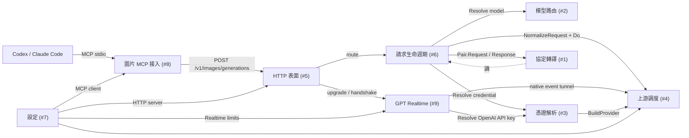

# proxy — 通用 LLM 協定轉譯代理 (Generic LLM Protocol Translation Proxy)

`proxy` 是一個通用的 LLM API 轉譯代理伺服器。它在客戶端 CLI (例如 Claude Code、Codex CLI) 與上游 LLM 提供者 (Anthropic、OpenAI、xAI、Google Gemini、MiniMax、Codex OAuth、Antigravity、Ollama) 之間居中：接收一種協定格式 (Anthropic Messages / OpenAI Chat Completions / OpenAI Responses)、依模型名稱路由到對應上游、把請求翻譯成上游原生協定 (含必要的 header/auth 規範化)、回程再翻譯回客戶端期待的格式 (含 SSE 串流)。

它同時具備`多帳號 OAuth 登入狀態的代理轉發`能力：`auth login --provider X` 寫入的憑證由 `proxy` 在每次請求時讀取、過期自動換發，並依 credentials 自動選擇 api-key 或 OAuth 模式。xAI API key 的 inference 維持走公開 `api.x.ai`；xAI OAuth inference 則依 [`xai-org/grok-build`](https://github.com/xai-org/grok-build/tree/b41c75a578f98bddbd326ab02cd53618451d97ee) contract 走 `cli-chat-proxy.grok.com`，支援 Responses、Chat Completions、Messages 三種上游協定。圖片生成可依 model 選擇 OpenAI Image API 或 xAI Imagine；OpenAI-compatible Image Edit 則由 `/v1/images/edits` 轉送 multipart personal image 與 styling prompt。內附的 [`proxy-imagegen` plugin](plugins/proxy-imagegen) 會把圖片 API 暴露成 `MCP` 工具，供 Codex 與 Claude Code 直接產圖、顯示圖片並取得專案內的檔案路徑。

---

## 業務領域 (Business Domains)

### 1. 協定轉譯 (Protocol Translation)

在 Anthropic Messages、OpenAI Chat Completions、OpenAI Responses 三種 LLM 線上格式之間做雙向轉譯，涵蓋非串流 JSON 與 SSE 串流。

`領域流程 (Domain Flow):`

1. `Handler.Handle(format)` 從 `transform.Registry.Lookup(format, targetFormat)` 取得對應的 `Pair`
2. 請求方向：`Pair.Request(ctx, RequestEnvelope)` 解碼來源 JSON、轉換欄位、編碼目標 JSON
3. 回應方向：`Pair.Response(ctx, ResponseEnvelope)` 解碼目標 JSON、轉換欄位、編碼來源 JSON
4. 串流方向：`Pair.NewStream(exchange)` 產生 `StreamTransform`，每個上游 SSE frame 進 `Push`、出一組來源格式 frame；`Close` 收尾
5. 當 client 要求非串流但上游只能串流 (例如 Codex OAuth) 時，啟動 `handleBridge`：用 `StreamCollector` 把整段串流摺成 JSON 回應

`核心實體 (Key Entities):` `Pair`, `RequestEnvelope`, `ResponseEnvelope`, `StreamTransform`, `StreamCollector`, `SSEFrame`, `Warning`, `SemanticLoss`

`相關處理器 (Related Handlers):` `svc/transform/registry.go`, `svc/transform/default.go`, `svc/transform/identity.go`, `svc/transform/response.go`, `svc/transform/collector.go`, `svc/transform/*_request.go`, `svc/transform/*_stream.go`

---

### 2. 模型路由 (Model Routing)

依客戶端送出的模型名稱，決定該請求要送給哪一家上游 provider family (anthropic / openai / xai / google / minimax) 以及要強制使用哪一種目標格式。

`領域流程 (Domain Flow):`

1. `Router.Resolve(format, modelName)` 檢查模型字串
2. 若帶 `/` 形式 (`provider/model` 或 `provider-<format>/model`)，對應到 `qualifier` 並剝離前綴為 `routed_model`；`*-responses`、`*-chat`、`*-messages` 分別強制 target = `FORMAT_OPENAI_RESPONSES`、`FORMAT_OPENAI_CHAT`、`FORMAT_ANTHROPIC_MESSAGES`
3. 否則依序比對 `ExactModels`、再比對 `Prefixes`，必須恰好命中一家，否則視為 `unknown_model`
4. 結果傳給 `Catalog.ResolveProfile` 解析成具體 `Profile` (含 endpoint、auth scheme、header allowlist、normalizer)

`核心實體 (Key Entities):` `route.Profile`, `Route`, `Router`, `Profile`, `Catalog`

`相關處理器 (Related Handlers):` `svc/route/router.go`, `svc/route/profile.go`, `svc/upstream/profile.go` (`ResolveProfile` / `NewRouter` / `DefaultCatalog`)

---

### 3. 憑證解析 (Credential Resolution)

從檔案儲存或環境變數挑選 provider family 對應的憑證，OAuth 過期時自動換發，並把憑證映射為 live `core.Provider` 物件供 dispatcher 使用。

`領域流程 (Domain Flow):`

1. `CredentialResolver.Resolve(ctx, family)` 委託 `auth/svc.Resolver`：優先從 `cfg.AuthDir` (`utils.NewFileStore`) 讀取，否則走 env fallback (`svc.EnvLookup`)
2. OAuth 模式下 `provider.For(cred).Refresh()` 在過期或即將過期時換發新 token 並 `Save` 回磁碟
3. dispatcher 端：`BuildProvider(cred)` 依 `cred.Kind` 分流到 `buildAPIKeyProvider` 或 `buildOAuthProvider`，把通用 `authmodel.Credential` 映射為該 provider 的 `WithAPIKey` 或 `NewWithOAuth` 構造參數；auth storage 的 `xai` family 會映射為 Agents SDK 的 `grok` provider
4. 結果是一個 `core.Provider` 實例，登錄到 `Dispatcher` 供後續請求使用

`核心實體 (Key Entities):` `authmodel.Credential`, `authmodel.Kind` (api_key / oauth), `CredentialResolver`, `core.Provider`, `auth/svc.Resolver`

`相關處理器 (Related Handlers):` `svc/upstream/credential.go`, `svc/upstream/dispatcher_oauth.go` (`BuildProvider`, `NewDispatcherWithAuth`, `NewDispatcherWithAuthAndEnv`), `handlers/server.go` (FileStore 組裝)

---

### 4. 上游調度 (Upstream Provider Dispatch)

封裝每一家上游 provider 的「連線目標 + 認證形式 + 請求規範化」，並管理運行期 `core.Provider` 物件集合。

`領域流程 (Domain Flow):`

1. 啟動時 `DefaultCatalog()` 載入 7 個 `Profile` (anthropic / minimax / openai-api / openai-codex-oauth / xai / xai-grok-oauth / google)，每個含 endpoint map、auth scheme、header allowlist、`AdvertisedModels`、選填的 `NormalizeRequest`；`openai-api`、`xai` 與 `xai-grok-oauth` 另宣告圖片 endpoint，其中 `openai-api` 同時宣告 Image Edit endpoint
2. `Client.do(...)` 依 profile + credential 構造 HTTP request、套用 allowlist 過濾 header、注入 `x-api-key` / `Authorization`、必要時加 `anthropic-version` / Codex headers / Grok OAuth headers；`Client.GenerateImage(...)` 與 `Client.EditImage(...)` 分別依 image profile 把 JSON 或 multipart bearer request 送到 OpenAI Image API 或 xAI Imagine
3. `Profile.NormalizeRequest(envelope)` 在轉譯完成後執行：例如 `normalizeCodexRequest` 把 `instructions` 從 system/developer 訊息裡 lift 出來、刪除 `max_output_tokens`、強制 `stream: true`；API-key `normalizeXAIRequest` 拒絕非 function 類型 tool；OAuth `normalizeXAIGrokOAuthRequest` 則保留 `x_search` 等 xAI raw tools，並依協定補齊 Grok defaults
4. `Dispatcher.Lookup(family)` 提供 `/v1/models` 端點的 `AdvertisedModels` 來源

`核心實體 (Key Entities):` `Profile`, `Catalog`, `Dispatcher`, `NormalizeRequest`, `NormalizedRequest`

`相關處理器 (Related Handlers):` `svc/upstream/profile.go`, `svc/upstream/dispatcher.go`, `svc/upstream/dispatcher_default.go`, `svc/upstream/client.go`

---

### 5. HTTP 公開介面與中介層 (HTTP Surface & Middleware)

把代理伺服器的 HTTP 表面組裝起來：路由表、認證、CORS、rate limit、metrics，以及 OpenAI Realtime 長連線入口。

`領域流程 (Domain Flow):`

1. `Server.New(cfg)` 透過 `gin.New()` 構造 engine，依序掛 `Recovery` → `mw.CorrelationID()` → `mw.Helmet()` → `corsLocalhost()`
2. 從 `cfg.APIKeySet()` 構造 `requireAPIKey` 中介層，掛在 `/v1/*` 與 `/admin/*`；支援 `Authorization: Bearer` 與 `x-api-key` 兩種格式，key 比對採 `subtle.ConstantTimeCompare` 防 timing oracle
3. 同一 group 上再掛 `rateLimitPerIP` (per-IP 60 req/min 固定窗口)
4. `router.HealthRouterGroup` / `router.PingRouterGroup` 提供 `/healthz` / `/ping`，自訂 `/health` 與 `/v1/*`、`/admin/*` 由 handler 與 group 註冊；`/v1/images/generations` 與 `/v1/images/edits` 由獨立 handler 做 OpenAI-compatible pass-through，不進三格式 transform matrix
5. `NewTransformObserver` 註冊 OTel counters：`agentsdk.proxy.transform.warnings`、`agentsdk.proxy.transform.losses`
6. `RealtimeHandler` 在同一 `/v1` 認證群組提供 WebSocket tunnel、WebRTC unified call 與 ephemeral client secret 三條 OpenAI-compatible 路徑

`核心實體 (Key Entities):` `Server`, `gin.Engine`, `TransformObserver`, `api-keys`, `rateBucket`

`相關處理器 (Related Handlers):` `handlers/server.go`, `handlers/image_generation.go`, `handlers/middleware.go`, `handlers/observability.go`, `cmd/proxy.go`

---

### 6. 請求生命週期與錯誤處理 (Request Lifecycle & Error Handling)

`Handler.Handle(format)` 編排一個請求從進入到結束的全流程，包含 body 讀取、路由、憑證、轉譯、上游呼叫、串流/非串流/橋接三條回程路徑、以及錯誤處理與結構化日誌。

`領域流程 (Domain Flow):`

1. `readRequestBody` 包 `MaxBytesReader` 限制 body 大小 (預設 `body-limit-mb=200`)，超過回 `request_too_large` 413
2. 解出 `model` / `stream` 後由 `Router.Resolve` → `CredentialResolver.Resolve` → `Catalog.ResolveProfile` 取得 `Profile`
3. `pair.Request` 翻譯請求；`recordDiagnostics` 把 `Warning` / `SemanticLoss` 餵給 observer
4. `Profile.NormalizeRequest` 套用 provider-specific 修正；codex 路徑額外呼叫 `logCodexRequestPayload` 印出脫敏後的 metadata (model / stream / store / instructions_bytes / input roles / tool names)
5. `Client.Do` 送上游；若 `BridgeToNonStream` 走 `handleBridge`、若 `stream` 走 `handleStream`、否則走 `handleNonStream`
6. 4xx/5xx 上游回應 → `logUpstreamError` 印出脫敏 headers + 截斷 body → `DecodeUpstreamError` 翻成 `ProxyError` → `writeError` 以來源格式編碼回 client
7. SSE 串流中途錯誤 → `logStreamError` 印出 cause token → `writeTerminalStreamError` 寫一條對應格式的錯誤 frame 結束串流

`核心實體 (Key Entities):` `Handler`, `HandlerDeps`, `Exchange`, `codexRequestPayloadSummary`, `ProxyError`

`相關處理器 (Related Handlers):` `handlers/handler.go`, `handlers/codex_log.go`, `handlers/upstream_error_log.go`, `model/error.go`

---

### 7. 設定與生命週期 (Configuration & Lifecycle)

透過 gosdk 的 layered viper 載入設定、補上預設值、提供 cobra CLI 與 graceful shutdown。

`領域流程 (Domain Flow):`

1. `cmd/proxy.go` `ProxyCmd.RunE` 呼叫 `pxconfig.LoadConfig()`：先 `gosdkconfig.Default(WithAppName("agentSDK"))` 合併 `settings.json` + `settings.local.json` (env 變數 `APP_*` 可覆寫無 dash 的鍵)
2. `setDefaults` 補上 `server.port=8317`、`body-limit-mb=200`、timeout 預設值
3. `ensureAPIKey`：若 `api-keys` 為空，隨機產生一把 `sk-...` 放進 in-memory config (不寫回磁碟)
4. `resolveAuthDir`：空字串時 fallback 到 `<AppDataDir>/auth`，`~` 開頭展開成絕對路徑
5. `Server.Run(ctx)` 用 `signal.NotifyContext(SIGINT, SIGTERM)` 啟動；`SHUTDOWN_TIMEOUT=10s` graceful shutdown，`WriteTimeout: 0` 避免切斷 SSE 串流

`核心實體 (Key Entities):` `Config`, `ServerConfig`, `TimeoutConfig`, `StatsConfig`, `ProxyCmd`

`相關處理器 (Related Handlers):` `config/config.go`, `cmd/proxy.go`, `main.go`, `svc/upstream/config.go`, `ecosystem.config.js` (pm2)

---

### 8. 圖片生成 MCP 接入 (Image Generation MCP Integration)

以同一個 `stdio MCP` server 接入 Codex 與 Claude Code，不要求兩套 client 各自實作 xAI wire protocol。

`領域流程 (Domain Flow):`

1. Plugin 執行 `proxy image-mcp`，以環境變數或 Claude Code `userConfig` 取得 proxy `base_url`、`port`、`api_key` 與預設模型
2. Agent 呼叫 `generate_image`，可傳 `prompt`、`model`、`n`、`aspect_ratio`、`resolution`
3. MCP client 強制送 `response_format: "b64_json"` 至 proxy `POST /v1/images/generations`
4. 回應經 Base64 解碼及實際 MIME 驗證後，寫入專案 `images/`，同時回傳 MCP image content 與相對路徑

`核心實體 (Key Entities):` `mcpimage.Config`, `ProxyClient`, `Generator`, `generate_image`

`相關處理器 (Related Handlers):` `mcpimage/config.go`, `mcpimage/client.go`, `mcpimage/tool.go`, `mcpimage/server.go`, `cmd/image_mcp.go`, `plugins/proxy-imagegen`

---

### 9. GPT 即時語音 (GPT Realtime Voice)

Realtime 語音不是第四種 request/response format，而是持續存在的雙向 session transport。proxy 保留 OpenAI GA Realtime event schema，不讓它進入既有 pairwise transform matrix。

`領域流程 (Domain Flow):`

1. 瀏覽器或行動端透過 `POST /v1/realtime/calls` 建立 WebRTC session，或先由 `POST /v1/realtime/client_secrets` 取得短效 token 後直連 OpenAI
2. server media pipeline 透過 `GET /v1/realtime?model=...` 升級成 WebSocket，雙向透傳 JSON event 與 Base64 audio chunk
3. downstream 使用 proxy API key；`CredentialResolver` 只接受標準 OpenAI API-key credential，移除 downstream authorization 後才注入 upstream credential
4. `RealtimeHandler` 固定 upstream path、限制握手 body 與同時 WebSocket session 數；不解析、不轉換、不記錄 audio/event payload
5. `OpenAI-Safety-Identifier` 可透過 proxy 傳入，但日誌只記錄是否存在，不記錄其值

`核心實體 (Key Entities):` `RealtimeHandler`, `RealtimeHandlerDeps`, `upstream.RealtimeTarget`, `RealtimeConfig`

`相關處理器 (Related Handlers):` `handlers/realtime.go`, `svc/upstream/realtime.go`, `handlers/server.go`, `config/config.go`

完整協定、failure semantics 與驗收證據：

📄 [`plans/2026-07-26-gpt-realtime-voice-proxy.md`](plans/2026-07-26-gpt-realtime-voice-proxy.md)

---

## 領域關聯 (Domain Relationships)


```mermaid
flowchart LR
    Agent["Codex / Claude Code"] -->|"MCP stdio"| ImageMCP["圖片 MCP 接入 (#8)"]
    ImageMCP -->|"POST /v1/images/generations"| HTTP["HTTP 表面 (#5)"]
    HTTP -->|"route"| Lifecycle["請求生命週期 (#6)"]
    Lifecycle -->|"Resolve model"| Routing["模型路由 (#2)"]
    Lifecycle -->|"Resolve credential"| Cred["憑證解析 (#3)"]
    Lifecycle -->|"Pair.Request / Response"| Trans["協定轉譯 (#1)"]
    Lifecycle -->|"NormalizeRequest + Do"| Upstream["上游調度 (#4)"]
    Realtime["GPT Realtime (#9)"] -->|"native event tunnel"| Upstream
    Realtime -->|"Resolve OpenAI API key"| Cred
    HTTP -->|"upgrade / handshake"| Realtime
    Cred -->|"BuildProvider"| Upstream
    Config["設定 (#7)"] -->|"HTTP server"| HTTP
    Config -->|"MCP client"| ImageMCP
    Config -->|"Realtime limits"| Realtime
    Config --> Upstream
    Trans -.->|"讀"| Lifecycle
```

- (#2) 路由的輸出是 (#4) 選 `Profile` 的輸入；二者共享 `route.Profile` 這個宣告結構。
- (#3) 解析出的 credential 同時被 (#4) 用來構造 request header，也被 (#4) dispatcher 拿來建 `core.Provider`。
- (#1) 與 (#4) 並無直接耦合：trans 層只讀 `model.Format`，upstream 層只讀 `Profile` 與 `Format`，handler 在中間把它們接起來。
- (#7) 設定只在啟動時影響 (#4)、(#5)、(#8) 與 (#9)；運行期無熱重載。

---

## 使用方式 (Usage)

`啟動伺服器 (Startup):`

```bash
go run ./...                          # 預設綁 :8317
go run ./... -- --port 9000           # 自訂埠
```

或透過 pm2 (見 `ecosystem.config.js`，namespace `Service`)：

```bash
pm2 start ecosystem.config.js
```

`模型選項 (Model Options):`

列出目前 proxy 內建的 Codex 模型，以及 Grok image-generation 可用的模型：

```bash
proxy options
# `proxy models` 亦可使用
```

Codex 會先列出 `gpt-5`、`gpt-5-mini`、`gpt-5.6-sol`、`gpt-5.6-terra`、`gpt-5.6-luna`；接著列出 OpenAI 的 `gpt-image-2` 與目前圖片 MCP 的 `grok-imagine-image-quality`。

`公共 API 端點 (Public Endpoints):`

| Path                          | Method | 用途                                                |
| ----------------------------- | ------ | --------------------------------------------------- |
| `/health`                     | GET    | 自訂 health (`{"status":"ok"}`)                     |
| `/healthz` / `/ping`          | GET    | gosdk 提供的運維端點                                |
| `/v1/models`                  | GET    | 列出 dispatcher 中所有 provider 的 catalog          |
| `/v1/chat/completions`        | POST   | OpenAI Chat Completions 介面 (代理至各家上游)        |
| `/v1/responses`               | POST   | OpenAI Responses 介面 (代理至各家上游)               |
| `/v1/messages`                | POST   | Anthropic Messages 介面                              |
| `/v1/messages/count_tokens`   | POST   | Anthropic 原生 token count 代理 (若 provider 支援)   |
| `/v1/images/generations`      | POST   | OpenAI `gpt-image-*` / xAI Imagine 圖片生成；JSON pass-through |
| `/v1/images/edits`            | POST   | OpenAI `gpt-image-*` / `dall-e-*` personal image outfit/hair edit；multipart pass-through |
| `/v1/realtime?model=...`      | GET    | OpenAI Realtime WebSocket event/audio tunnel          |
| `/v1/realtime/calls`          | POST   | WebRTC unified-interface SDP/session 建立             |
| `/v1/realtime/client_secrets` | POST   | 建立瀏覽器/行動端使用的短效 Realtime credential      |
| `/admin/accounts`             | GET    | 預留 — `notImplemented`                             |
| `/admin/stats`                | GET    | 預留 — `notImplemented`                             |
| `/admin/reload`               | POST   | 預留 — `notImplemented`                             |

`路由規範 (Routing Examples):`

```text
claude-3-5-sonnet-20240620                → anthropic
gpt-4o / o1-preview                      → openai (api_key) / openai-codex-oauth (oauth)
grok-2 / grok-2-mini                     → xai
gemini-1.5-pro                           → google
MiniMax-Text-01 / minimax-M2             → minimax
openai/gpt-4o                            → openai (強制走 openai family)
xai-responses/grok-4.5                    → xai (強制走 Responses)
xai-chat/grok-4.5                         → xai (強制走 Chat Completions)
xai-messages/grok-4.5                     → xai (強制走 Messages)
```

`xAI Grok OAuth inference contract`:

| Credential | Profile | Base URL | 支援的上游協定 |
| ---------- | ------- | -------- | -------------- |
| `xai` API key | `xai` | `https://api.x.ai` | Responses、Chat Completions |
| `xai` OAuth | `xai-grok-oauth` | `https://cli-chat-proxy.grok.com/v1` | Responses、Chat Completions、Messages |

- OAuth Responses endpoint：`/responses`；缺少 `store` 時補 `false`，並確保 `include` 含 `reasoning.encrypted_content`。
- Anthropic Messages 與 Responses 之間的 reasoning history 保留原始順序與 `id` / `summary` / `content` / `encrypted_content` / `status`；opaque metadata 透過 v2 `thinking.signature`（串流為 `signature_delta`）交給 Claude Code 往返，並相容既有 v1 signature decode，避免 tool loop 第二輪遺失 Grok reasoning state。
- OAuth Chat endpoint：`/chat/completions`；串流時補 `stream_options.include_usage=true`。
- OAuth Messages endpoint：`/messages`；`max_tokens` 缺少或為 `0` 時補 `128000`。
- OAuth request 固定注入 `X-XAI-Token-Auth: xai-grok-cli`、`x-authenticateresponse: authenticate-response`、`x-grok-client-*` 與 request metadata；`x-grok-model-override` 由實際 routed model 產生，不能由 downstream spoof。
- OAuth response 的 `x-grok-context-window`、`x-grok-max-completion-tokens`、`x-models-etag`、`x-should-retry` 會在成功與錯誤回應中安全轉送。
- xAI 登入、token refresh 與持久化仍由 `github.com/bizshuk/auth` 的 `xai_oauth` device flow 負責；本專案實作的是三種 inference wire protocol，不代理 Grok Conversations / Workspaces 產品 API。

`Image generation provider contract`:

- downstream 呼叫 `POST /v1/images/generations`；必要欄位為 `model` 與 `prompt`，其餘欄位原樣轉送。
- `gpt-image-*` 與 `dall-e-*` model 使用 `openai` API-key credential，直接呼叫 `https://api.openai.com/v1/images/generations`。
- xAI model 使用 `xai` API-key 或 OAuth credential，直接呼叫 `https://api.x.ai/v1/images/generations`；OAuth 使用既有 resolver 換發後的 access token 作 Bearer。
- OpenAI OAuth credential 會解析成 Codex profile；Codex profile 不提供圖片 endpoint，因此不會把 Codex OAuth token 當作 OpenAI API key 使用。
- Imagine OAuth request 不帶 inference-only 的 `X-XAI-Token-Auth`、`x-authenticateresponse` 或 `x-grok-model-override`。
- upstream status、safe headers 與 JSON body 原樣回傳；若 client 要儲存圖片，應送 `response_format: "b64_json"` 並由 client-side MCP tool 解碼。
- timeout 對齊 Grok Build：總請求 `300s`、response-header wait `240s`。

`Image Edit provider contract`:

- downstream 呼叫 `POST /v1/images/edits`；必要 multipart fields 為 `model`、`prompt` 與非空 `image`，其餘 fields 原樣轉送。
- `gpt-image-*` 與 `dall-e-*` model 使用 `openai` API-key credential，直接呼叫 `https://api.openai.com/v1/images/edits`；proxy 不把 image bytes 或 prompt 寫入一般 routing log。
- OpenAI OAuth/Codex credential 不提供 Image Edit capability；必須由 server-side `OPENAI_API_KEY` 或 stored OpenAI API-key credential 提供上游 Bearer。
- upstream status、safe headers 與 JSON body 原樣回傳；success response 預期為 OpenAI `data[].b64_json`。

### Codex / Claude Code 圖片生成 Plugin

Plugin 只負責啟動 `stdio MCP` server；`proxy` binary 與 HTTP proxy server 是兩個獨立程序。先安裝 binary，並另行啟動 HTTP proxy：

```bash
go install .
proxy --port 8317
```

`Codex` 安裝：

```bash
export PROXY_IMAGE_BASE_URL="http://127.0.0.1"
export PROXY_IMAGE_PORT="8317"
export PROXY_IMAGE_API_KEY="sk-..."
export PROXY_IMAGE_MODEL="grok-imagine-image-quality"
export PROXY_IMAGE_OUTPUT_DIR="images"

codex plugin marketplace add .
codex plugin add proxy-imagegen@proxy-local
```

`Codex` plugin 透過 `env_vars` 從啟動 Codex 的環境轉送設定；變更後需開新 session。`PROXY_IMAGE_API_KEY` 必填，也可改用既有的 `AGENTSDK_PROXY_API_KEY`。

`Claude Code` 安裝：

```bash
export PROXY_IMAGE_API_KEY="sk-..."

claude plugin marketplace add .
claude plugin install proxy-imagegen@proxy-local \
  --config base_url=http://127.0.0.1 \
  --config port=8317 \
  --config api_key="$PROXY_IMAGE_API_KEY" \
  --config model=grok-imagine-image-quality
```

安裝後可直接要求 agent 生成圖片，或呼叫 `/imagine <prompt>`。`generate_image` 會回傳 inline MCP image content，並預設把檔案寫到目前專案的 `images/`。

| 設定 | 預設值 | 說明 |
| --- | --- | --- |
| `PROXY_IMAGE_BASE_URL` / `base_url` | `http://127.0.0.1` | Proxy scheme 與 host，不含 port |
| `PROXY_IMAGE_PORT` / `port` | `8317` | Proxy HTTP port |
| `PROXY_IMAGE_API_KEY` / `api_key` | 無 | Proxy 接受的 Bearer key，必填 |
| `PROXY_IMAGE_MODEL` / `model` | `grok-imagine-image-quality` | 工具未指定 `model` 時使用 |
| `PROXY_IMAGE_OUTPUT_DIR` | `images` | Codex 可覆寫；相對路徑必須留在專案內 |

若要使用 OpenAI `gpt-image-2`，在 proxy 執行環境提供 `OPENAI_API_KEY`，並把 `PROXY_IMAGE_MODEL` / plugin `model` 設為 `gpt-image-2`；MCP 連回 proxy 的 `PROXY_IMAGE_API_KEY` 仍是另一組 proxy access key。

`HTTP client 設定範例 (Client Config):`

```bash
# Claude Code (.env or settings.local.json)
ANTHROPIC_BASE_URL=http://localhost:8317
ANTHROPIC_API_KEY=sk-...

# Codex CLI
OPENAI_BASE_URL=http://localhost:8317/v1
OPENAI_API_KEY=sk-...

# Server-side Realtime WebSocket
websocat -H='Authorization: Bearer sk-...' \
  'ws://localhost:8317/v1/realtime?model=gpt-realtime-2.1'
```

`瀏覽器 Realtime WebRTC sample:`

```bash
python3 -m http.server 8080 --directory scripts
open http://localhost:8080/realtime-webrtc.html
```

頁面會把 SDP 與 session config 送到 proxy 的 `/v1/realtime/calls`；麥克風與模型音訊走 WebRTC media track，Realtime events 走 `oai-events` data channel。瀏覽器欄位只應填 proxy API key，不得填 OpenAI upstream key。

`結構化日誌 (Structured Logs):`

- `proxy request routed` / `proxy request completed` / `proxy count_tokens routed`
- `proxy transform warning` / `proxy transform semantic loss`
- `proxy codex request payload` (Debug 級，脫敏)
- `proxy upstream error response` / `proxy upstream stream error`
- `proxy realtime session routed` / `proxy realtime session completed` / `proxy realtime upstream failed`

`Metrics (OTel):`

- `agentsdk.proxy.transform.warnings` (counter, labels: provider / source_format / target_format)
- `agentsdk.proxy.transform.losses` (counter, labels: provider / source_format / target_format)

---

## 改善建議 (Improvement Suggestions)

依 codebase 觀察：

- [ ] 補齊 admin 端點 (`/admin/accounts`、`/admin/stats`、`/admin/reload`)：目前回 501，但 server 已經持有了 `Catalog` 與 `Dispatcher`，寫一個 `listAccounts` / `reloadDispatcher` 即可落地；能讓 multi-credential 管理不需 ssh 上機器
- [ ] 從 `model.Format` 收斂為 enum-ish union：`svc/transform/registry.go` 與 `svc/upstream/profile.go` 各用一個 `Format` 字串做配對，加上 `Endpoints map[Format]string`；當前 8-pair matrix 是手寫的，若把 3 個 format 用 sealed interface 表示，能讓 missing-pair 驗證從 run-time 提前到 compile-time
- [ ] `Dispatcher.AdvertisedModels` 與 `Catalog.AdvertisedModels` 兩套來源需收斂：現在 `/v1/models` 只看 dispatcher，若 dispatcher 為 nil 就退回 catalog；應該設計一個 `ModelLister` interface 兩者都實作、由 server 注入一份
- [ ] 把 `subosito/gotenv` 與 `goccy/go-yaml` 從 indirect 收掉：`go.mod` 的 indirect 區顯示這兩個是 gosdk 拖來的，本專案未直接用；定期 `go mod tidy` 可減少供應鏈面
- [ ] 補上 healthz 與 ping 的 coverage：handlers 透過 `router.HealthRouterGroup` 借用 gosdk 的端點，但 proxy 自己的整合測試 (`handlers/server_test.go`) 應再驗一次 `/health` 對 `gin.SetMode(gin.ReleaseMode)` 切換的反應
- [ ] `Settings.example.json` 的 `cloaking: {}` 對應 `Config.Cloaking map[string]any` 但下游沒有任何 handler 讀它；若屬未來預留，應在 spec 註明；若是遺留 dead config，移除以免誤導
