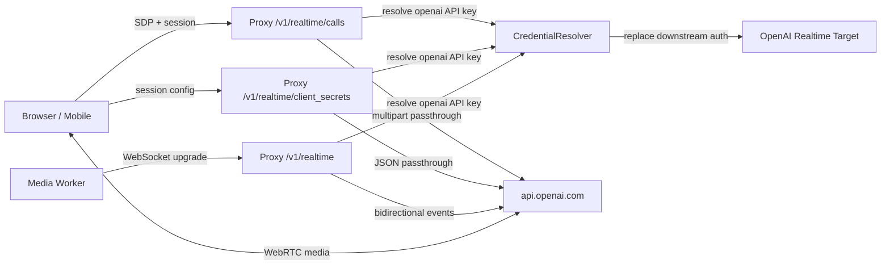

# GPT 即時語音代理與協定設計 (GPT Realtime Voice Proxy and Protocol Design)

日期：2026-07-26

狀態：`Phase 1 implementation landed; verification pending`

## 1. 結論

GPT 即時語音使用 OpenAI Realtime API 的長連線、雙向事件協定，不是既有 Anthropic Messages、OpenAI Chat Completions、OpenAI Responses 之間的第四種 wire format。

本專案採兩條 transport：

| Client 類型 | Transport | Proxy surface | Media path |
| --- | --- | --- | --- |
| Browser / mobile | WebRTC | `POST /v1/realtime/calls` 或 `POST /v1/realtime/client_secrets` | WebRTC media track |
| Server media pipeline / worker | WebSocket | `GET /v1/realtime?model=<model>` | Base64 audio in JSON events |

共同原則：

- downstream 使用 proxy API key。
- upstream 只使用 credential store 解析出的標準 OpenAI API key。
- OpenAI Realtime GA event schema 原樣透傳。
- 不記錄 audio、transcript、instructions、tool arguments 或其他 event payload。
- 不加入 `model.ALL_FORMATS`，因此不擴張 pairwise transform matrix。

## 2. 官方契約基準

設計依據：

- [Realtime and audio](https://developers.openai.com/api/docs/guides/realtime)
- [Realtime API with WebRTC](https://developers.openai.com/api/docs/guides/realtime-webrtc)
- [Realtime API with WebSocket](https://developers.openai.com/api/docs/guides/realtime-websocket)
- [Realtime conversations](https://developers.openai.com/api/docs/guides/realtime-conversations)

採用 GA 介面：

- 不送 legacy `OpenAI-Beta: realtime=v1`。
- WebRTC unified interface 使用 `/v1/realtime/calls`。
- ephemeral credential 使用 `/v1/realtime/client_secrets`。
- WebSocket 使用 `/v1/realtime?model=...`。
- session payload 使用 `session.type = "realtime"`。
- output audio 設定位於 `session.audio.output`。
- output event 使用 `response.output_audio.*`、`response.output_audio_transcript.*`、`response.output_text.*`。

## 3. 範圍

### 3.1 In scope

- OpenAI Realtime voice-agent session。
- WebSocket upgrade 與雙向 opaque tunnel。
- WebRTC unified call initialization。
- WebRTC ephemeral client secret minting。
- downstream proxy authentication。
- upstream credential resolution 與 replacement。
- 固定 endpoint、防 SSRF、握手 body 上限、連線數上限。
- metadata-only structured logs。

### 3.2 Out of scope

- Anthropic / Chat / Responses 與 Realtime event 的語意翻譯。
- server-side audio codec conversion、resampling 或 VAD。
- SIP、translation session、transcription-only session。
- proxy 內執行 Realtime function tool。
- event payload inspection、內容稽核或 transcript persistence。

## 4. 架構



責任：

```tree
handlers/realtime.go
├── validate transport preconditions
├── enforce local resource limits
├── resolve request-scoped credential
├── drive reverse proxy lifecycle
└── emit metadata-only logs

svc/upstream/realtime.go
├── allowlist fixed OpenAI Realtime endpoints
├── require OpenAI API-key credential
├── build and validate upstream URL
├── replace downstream authentication
└── filter ordinary HTTP response headers
```

## 5. Downstream protocol

### 5.1 WebSocket

Request：

```http
GET /v1/realtime?model=gpt-realtime-2.1 HTTP/1.1
Host: localhost:8317
Authorization: Bearer <proxy-api-key>
Connection: Upgrade
Upgrade: websocket
OpenAI-Safety-Identifier: <privacy-preserving-id>
```

Preconditions：

- `Upgrade: websocket` 必須存在。
- `model` query 必須非空。
- 全域 Realtime WebSocket slot 尚有容量。
- credential provider 必須是 `openai` 且 kind 必須是 `api_key`。

Upstream request：

```http
GET /v1/realtime?model=gpt-realtime-2.1 HTTP/1.1
Host: api.openai.com
Authorization: Bearer <resolved-openai-api-key>
Connection: Upgrade
Upgrade: websocket
```

proxy 保留安全的 tracing headers、WebSocket handshake headers 與 `OpenAI-Safety-Identifier`，移除 downstream `Authorization`、`x-api-key`、cookie、forwarded headers 與其他 hop-by-hop credential。

### 5.2 WebRTC unified interface

Downstream 與 OpenAI upstream 使用相同 multipart shape：

```http
POST /v1/realtime/calls HTTP/1.1
Authorization: Bearer <proxy-api-key>
Content-Type: multipart/form-data; boundary=...
```

Multipart fields：

| Field | Content |
| --- | --- |
| `sdp` | Browser 建立的 SDP offer |
| `session` | JSON session configuration |

Session example：

```json
{
  "type": "realtime",
  "model": "gpt-realtime-2.1",
  "audio": {
    "output": {
      "voice": "marin"
    }
  }
}
```

成功 response 是 `application/sdp` answer。Browser 將它設為 `RTCPeerConnection` 的 remote description。

### 5.3 Ephemeral client secret

Request：

```http
POST /v1/realtime/client_secrets HTTP/1.1
Authorization: Bearer <proxy-api-key>
Content-Type: application/json
OpenAI-Safety-Identifier: <privacy-preserving-id>
```

Body：

```json
{
  "session": {
    "type": "realtime",
    "model": "gpt-realtime-2.1",
    "audio": {
      "output": {
        "voice": "marin"
      }
    }
  }
}
```

回傳的短效 token 只用來由 browser/mobile 直接建立 Realtime connection。標準 OpenAI API key 不得離開 proxy。

## 6. Event protocol

WebRTC data channel 與 WebSocket 都傳 OpenAI GA JSON events。proxy 不 decode body，只保證 transport 與 lifecycle。

### 6.1 Session

```text
server: session.created
client: session.update
server: session.updated
```

`session.update` 可設定 instructions、audio input/output、turn detection、tools 與 tool choice。voice 一旦已產生第一段 audio 後不得再改。

### 6.2 WebSocket audio input

```text
client: input_audio_buffer.append*
client: input_audio_buffer.commit       # manual turn only
client: response.create                 # manual response only
```

`input_audio_buffer.append.audio` 是 Base64 audio chunk。OpenAI 的單一 chunk 上限由 upstream 契約執行；proxy 不 decode Base64。

### 6.3 WebRTC audio input

Audio 走 WebRTC media track，不需把 chunk 包成 client event。data channel 仍承載 session、conversation、tool 與 lifecycle events。

### 6.4 Output

主要 server events：

```text
response.created
response.output_item.created
response.content_part.added
response.output_audio.delta*
response.output_audio_transcript.delta*
response.output_text.delta*
response.output_audio.done
response.output_audio_transcript.done
response.output_text.done
response.content_part.done
response.output_item.done
response.done
rate_limits.updated
```

同一 response 的 text、audio 與 transcript delta 可能交錯。client 必須用 response/item/content identifiers 組裝，不可依 event 到達順序假設單一線性 stream。

## 7. Authentication and security

| Boundary | Rule |
| --- | --- |
| Downstream auth | 沿用 `requireAPIKey`，接受 `Authorization: Bearer` 或 `x-api-key` |
| Upstream auth | 由 `CredentialResolver.Resolve(ctx, "openai")` 解析 |
| Credential kind | 僅 `api_key`；Codex OAuth 明確拒絕 |
| Endpoint | 三個 compile-time allowlisted fixed paths |
| Base URL | HTTPS，或 credential 明確設定的 loopback HTTP |
| Header forwarding | tracing + safety identifier + transport-required headers |
| Body | handshake body bounded；audio/event payload opaque |
| Logs | metadata only，不含 safety identifier value 或 payload |
| Browser origin | 沿用 `corsLocalhost` |
| Capacity | WebSocket 使用全域 bounded semaphore |

`OpenAI-Safety-Identifier` 應是穩定、不可反推個人身分的 hash。proxy 只轉送、不保存、不印出。

## 8. Failure semantics

| Failure | HTTP / connection behavior | Public code |
| --- | --- | --- |
| 非 WebSocket upgrade | `426` | `websocket_upgrade_required` |
| WebSocket 缺 model | `400` | `model_required` |
| 連線數已滿 | `429` | `realtime_connection_limit` |
| 握手 body 超限 | `413` | `realtime_handshake_too_large` |
| OpenAI credential 不存在 | `503` | `credential_unavailable` |
| credential 不是 API key | `401` | `realtime_api_key_required` |
| upstream handshake/transport 失敗 | `502`，尚未 upgrade 時回 JSON error | `realtime_upstream_error` |
| upstream 4xx/5xx | 保留 upstream status 與 body，過濾 response headers | upstream native error |
| upgrade 後任一方向斷線 | 關閉 tunnel；不再嘗試寫 HTTP JSON |

不做 session reconnect。Realtime conversation state 與音訊序列不能安全地由 proxy 自動 replay。

## 9. Observability

Logs：

- `proxy realtime session routed`
- `proxy realtime session completed`
- `proxy realtime upstream response`
- `proxy realtime upstream failed`

固定 attrs：

- `request_id`
- `provider=openai`
- `transport=websocket|webrtc`
- `endpoint`
- `model`，僅 WebSocket query
- `status`
- `duration_ms`
- `has_safety_identifier`

禁止 attrs：

- Authorization / API key
- SDP
- audio bytes
- transcript
- instructions
- conversation item content
- tool arguments / tool outputs
- safety identifier value

## 10. Incremental landing

### Phase 1: Native transport proxy

- 三個固定路徑。
- API-key credential replacement。
- WebSocket opaque tunnel。
- WebRTC call/client-secret body passthrough。
- body 與 concurrent connection limits。
- metadata-only logs。
- `scripts/realtime-webrtc.html` browser speech-to-speech sample。
- README、CLAUDE、settings example 同步。

### Phase 2: Isolated verification

- 使用 fake upstream 驗證 WebSocket `101` upgrade 與雙向 frame。
- 驗證 downstream auth 絕不出現在 upstream。
- 驗證 OpenAI API key replacement。
- 驗證 multipart/JSON request body byte-for-byte passthrough。
- 驗證 413、426、429、credential kind 與 upstream error。
- 驗證 response header filtering。

### Phase 3: Live acceptance

- 使用測試用 OpenAI project API key。
- 跑一條 WebRTC speech-to-speech session。
- 跑一條 WebSocket audio event session。
- 確認 cancel/disconnect 釋放 upstream connection 與 connection slot。
- 確認 logs 不含音訊、transcript、prompt 或 credential。

### Phase 4: Operations

- OTel active connection gauge。
- handshake success/failure counter。
- session duration histogram。
- capacity rejection counter。
- 依 production evidence 調整 `max-connections`。

## 11. Acceptance criteria and evidence

| Requirement | Authoritative evidence | Current state |
| --- | --- | --- |
| Realtime 不污染 pairwise matrix | `model.ALL_FORMATS` 與 registry source | Designed and implemented separately |
| 三個固定路徑完成接線 | `handlers/server.go` route table | Implemented, not yet executed |
| downstream credential 被替換 | fake upstream captured headers | Missing verification |
| WebSocket 真正雙向 | isolated `101` + frame round trip | Missing verification |
| WebRTC body 不被修改 | fake upstream captured bytes | Missing verification |
| resource limits 生效 | isolated 413/429 cases | Missing verification |
| live voice 可用 | real WebRTC and WebSocket sessions | Missing verification |
| payload 不進 log | captured structured logs | Missing verification |

完成條件不是「程式存在」，而是上表每項都有對應證據。Phase 2 與 Phase 3 完成前，本計畫保持進行中。
