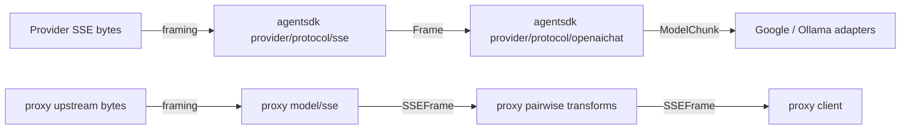
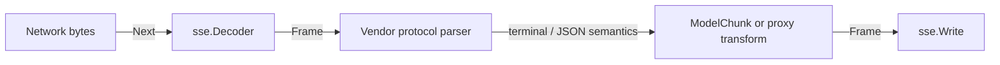

# 架構計畫 — agentsdk-protocol-handover

狀態：`Partially Landed`

日期：`2026-07-28`

## 1. 目標與範圍 (Goal & Scope)

目標：

- 讓 `agentsdk` 成為通用 SSE framing primitive 的單一 owner。
- 評估公開的 `provider/protocol/openaichat` 是否能取代
  `proxy/model/chat/types.go`。
- 將「上游 API 已落地」與「provider / proxy 已採用」分開驗收。

不在本計畫範圍：

- 不把 `proxy/svc/transform` 的 pairwise translation 上移。
- 不把 provider-specific terminal event 放進 generic SSE package。
- 不因 DTO 欄位相似就合併 Anthropic、Responses 或其他 vendor wire model。
- 本輪不修改 `proxy` 的 Go dependency 或 production code。

## 2. 現況架構 (Current Architecture)

已確認的版本與程式碼：

| 邊界 | 現況 |
| --- | --- |
| `proxy` dependency | `go.mod` 仍使用 `github.com/bizshuk/agentsdk v0.0.16` |
| `proxy` SSE | `model/sse.go` 自有完整 frame decoder / writer，含 BOM 與 `1 MiB` 上限 |
| `agentsdk` SSE | `v0.0.19` 已公開 stdlib-only `provider/protocol/sse`；`v0.0.21` 可由 Go module proxy 下載 |
| `agentsdk` parser adoption | `provider/protocol/openaichat` 已採用共用 decoder；Anthropic、Antigravity、Codex、Grok、MiniMax 五份 parser 仍各自使用 `bufio.Scanner` |
| `agentsdk` OpenAI Chat | `v0.0.17` 已將 `provider/internal/openaichat` 移至公開的 `provider/protocol/openaichat` |
| `proxy` OpenAI Chat | `model/chat/types.go` 保存 client / upstream wire DTO，供 `3×3` pairwise transform 使用 |



## 3. 架構位置與邊界 (Placement & Boundaries)

目標依賴方向：

```text
proxy
├── agentsdk/provider/protocol/sse
│   └── Go stdlib
└── proxy/model/chat
    └── proxy pairwise transform DTO

agentsdk provider adapters
├── provider/protocol/sse
└── provider-specific payload / terminal semantics
```

Owner 規則：

- `agentsdk/provider/protocol/sse`
  - 擁有空行 frame boundary、multiline `data`、UTF-8 BOM、`event`、`id`、
    `retry`、comments、line / frame 上限與 writer。
  - 不解讀 `[DONE]`、`message_stop`、`response.completed`。
- `agentsdk/provider/protocol/openaichat`
  - 擁有已由 Google / Ollama contract tests 證明相容的
    `core.Model* ↔ OpenAI Chat wire` projection。
  - 不成為所有 OpenAI-compatible wire DTO 的公共 schema。
- `proxy/model/chat`
  - 擁有 pairwise translation 所需的完整 Chat wire shape。
  - 不繞經 `core.Model*`，避免不可逆的 semantic loss。
- `proxy/svc/transform`
  - 保留來源格式與目標格式之間的 translation、stream state 與 terminal semantics。

## 4. 介面與資料流 (Interfaces & Data Flow)

公開 contract 控制在四組：

| Contract | 責任 |
| --- | --- |
| `sse.Frame` | 完整 transport frame，不含 provider payload semantics |
| `sse.NewDecoder` / `NewBoundedDecoder` + `Decoder.Next` | bounded frame decoding |
| `sse.Write` | frame encoding |
| `openaichat.EncodeRequest` / `DecodeResponse` / `ParseStream` | provider-neutral `core.Model*` projection |



## 5. 評估結論 (Assessment)

### 5.1 SSE primitive

結論：`採用`。

`agentsdk/provider/protocol/sse` 與 `proxy/model/sse.go` 的 transport contract
相同，且上游額外覆蓋 nil reader。`proxy` 不應再維護第二份實作。

但 package 存在不代表遷移完成：

- 目前只有 `provider/protocol/openaichat` 使用共用 decoder。
- Anthropic、Antigravity、Codex、Grok、MiniMax 仍逐行解析，沒有 BOM 與完整
  multiline frame 行為。
- 每個 parser 必須先鎖定自身 `[DONE]` / `message_stop` /
  `response.completed`、transport error、context cancellation 與 terminal chunk
  contract，再個別換成 `sse.Decoder`。

### 5.2 公開 `openaichat`

結論：`公開已完成，但不取代 proxy/model/chat`。

兩者的責任不同：

| 能力 | `agentsdk/provider/protocol/openaichat` | `proxy/model/chat` |
| --- | --- | --- |
| 輸入 / 輸出 | `core.ModelRequest` / `ModelResult` / `ModelChunk` | 完整 Chat wire DTO |
| DTO visibility | request / response / stream DTO 為 private | translation 可直接操作 exported DTO |
| message content | canonical text / tools projection | string-or-multipart union，含 image URL |
| request controls | adapter 使用的子集合 | `max_completion_tokens`、`top_p`、`stop`、`tool_choice`、`reasoning_effort`、`parallel_tool_calls` 等 |
| response fidelity | fold 成 runtime result | 保留 `id`、`object`、`created`、`model`、choices、usage details |
| stream behavior | fold 成 channel；framing error 以關閉 channel 表達 | pairwise transform 需保留 choice index、finish reason、usage，並把錯誤編成來源格式 |

因此 `proxy` 若直接重用 `openaichat`，會先把 wire payload 投影成
`core.Model*` 再重建另一種 wire format；這會丟失 translation 所需資訊。
除非未來至少兩個 lossless wire consumer 以 golden tests 證明完全相容，否則不再要求
agentsdk 擴大公開 DTO surface。

## 6. 漸進落地步驟 (Incremental Steps)

1. `已完成`：agentsdk 以 `v0.0.17` 公開 `provider/protocol/openaichat`，以
   `v0.0.19` 公開 `provider/protocol/sse`。
2. `agentsdk follow-up`：五個剩餘 parser 各自加入 BOM、multiline frame、
   oversize / partial frame、terminal semantics regression tests，再改用
   `sse.Decoder`。每個 provider 可獨立回滾。
3. `proxy follow-up`：升級至已發布且含 reasoning contract 的 `v0.0.21`；先把
   `model/sse.go` 改為 `sse.Frame` / `Decoder` / errors / constants 的 compatibility
   aliases 與薄 wrapper，保持現有 `model.SSEFrame` 呼叫者不動。
4. 通過 `model`、`svc/transform`、`handlers` 全部測試後，再決定是否讓 callers
   直接 import `provider/protocol/sse` 並刪除 compatibility facade。
5. `proxy/model/chat/types.go` 維持原位；本提案不安排 `openaichat` migration。

## 7. 驗收與回滾 (Verification & Rollback)

目前證據：

- `go test ./provider/protocol/sse ./provider/protocol/openaichat`：通過。
- `go mod download github.com/bizshuk/agentsdk@v0.0.21`：通過。
- remote tags `v0.0.17`、`v0.0.19`、`v0.0.21`：存在。

後續 code migration 的必要 gate：

```bash
go test ./model ./svc/transform ./handlers
go test ./...
git diff --check
```

若任一 provider 的 observable stream contract 改變，回滾該 provider 的 consumer
改動即可；共用 `sse` package 與其他已遷移 provider 不需一起回滾。
