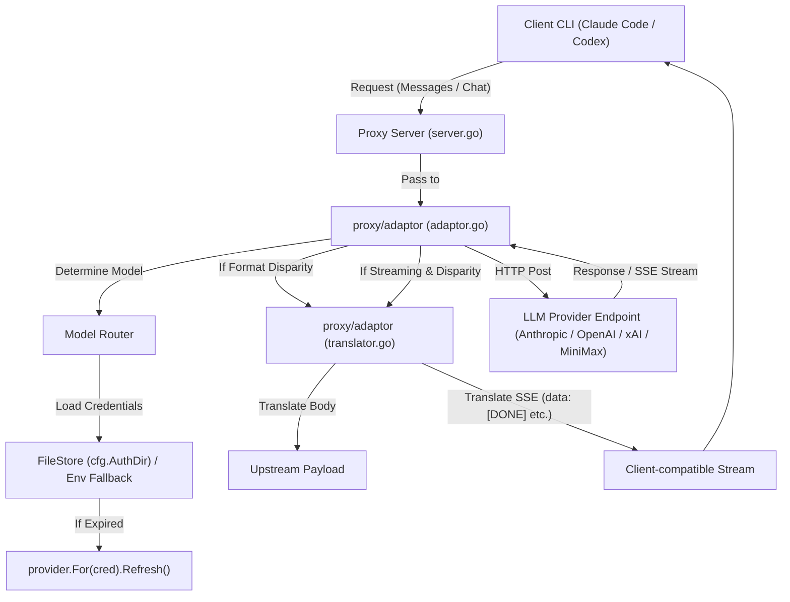

# client-llm-adaptor 設計規格 (Design Specification)

> 狀態：已由 [pairwise agent-provider transform](2026-07-16-pairwise-agent-provider-transform.md) 取代。本文件只保留為 legacy one-to-one adaptor 的歷史設計，不代表現行 production architecture。

本文件描述 `agentSDK` Proxy 伺服器與 LLM 提供者 (LLM Provider) 之間的轉接器 (Adaptor) 設計。該轉接器負責將來自客戶端 CLI (Claude Code/Codex) 的請求路由、轉譯並轉發至後端支援的 LLM 提供者，並將其回應/串流轉譯回客戶端格式。

---

## 1. 職責與元件邊界 (Responsibilities and Boundaries)

轉接器位於 `proxy/adaptor/` 目錄下：
- `proxy/adaptor/adaptor.go`: 處理請求路由、憑證加載 (FileStore / Env)、權杖自動刷新 (Token Auto-Refresh) 與請求發送。
- `proxy/adaptor/translator.go`: 負責客戶端協定與 LLM 提供者協定之間的雙向資料結構轉譯 (請求 Body 及 SSE 串流 delta)。

---

## 2. 模型與提供者路由規則 (Model and Provider Routing)

轉接器依據請求中的 `model` 欄位決定目標提供者：
- **Anthropic (Claude Code)**: 模型名稱前綴或包含 `claude-`、`sonnet`、`haiku`、`opus`。
- **OpenAI (GPT)**: 模型名稱前綴或包含 `gpt-`、`o1-`、`o3-`。
- **xAI (Grok)**: 模型名稱前綴或包含 `grok-`。
- **MiniMax**: 模型名稱前綴或包含 `minimax-`、`MiniMax-`。

---

## 3. 憑證加載與 Fallback 機制 (Credential Resolution)

1. **FileStore 優先**:
   - 轉接器初始化 `auth.NewFileStore(cfg.AuthDir)`。
   - **Active 選擇器**: 讀取 `active.json`。該檔案以 JSON 格式記錄每個提供者當前選用的主動憑證名稱（例如 `{"anthropic": "anthropic-user1@example.com_oauth"}`）。
   - 當有多個憑證時：
     - 若 `active.json` 中有對應的憑證名稱且該憑證檔案存在，則優先選用該憑證。
     - 若 `active.json` 未指定或指定的憑證不存在，則預設選用該提供者在 FileStore 中列出的第一個憑證。
   - 在發送請求前，呼叫 `cred.Expired(DEFAULT_EXPIRY_SKEW)`。若過期或即將過期，使用 `provider.For(cred)` 建立對應的 Authenticator，呼叫其 `Refresh(ctx, cred)` 換發新憑證並利用 `store.Save(newCred)` 存回磁碟。
2. **環境變數 Fallback**:
   - 若 FileStore 中無對應憑證，則嘗試從環境變數取得 API Key 與預設端點：
     - **Anthropic**: `ANTHROPIC_API_KEY` (端點 `https://api.anthropic.com`)
     - **OpenAI**: `OPENAI_API_KEY` (端點 `https://api.openai.com/v1`)
     - **xAI**: `XAI_API_KEY` (端點 `https://api.x.ai/v1`)
     - **MiniMax**: `MINIMAX_API_KEY` (端點 `https://api.minimax.io/anthropic` 或 `https://api.minimax.io/v1`)

---

## 3.5 憑證切換指令 (The `use` Command)

為了支援多憑證切換，新增 `use` 子指令：
- **用法**: `agentsdk use <credential-name>`
- **行為**:
  1. 檢查輸入的 `<credential-name>` 是否存在於 `FileStore` 中。
  2. 若不存在，印出錯誤訊息。
  3. 若存在，解析其對應的 `provider` (如 `anthropic`, `openai`)。
  4. 讀取現有的 `active.json`，更新該 `provider` 的映射為新的 `<credential-name>`。
  5. 寫回 `active.json`。
  6. 印出成功訊息：`Active credential for provider 'anthropic' set to 'anthropic-user1@example.com_oauth'`。

---

## 4. 協定轉譯與串流處理 (Protocol Translation & Streaming)

轉譯元件 (`translator.go`) 提供以下雙向轉譯功能：

### A. 請求轉譯 (Request Translation)
- **Anthropic Messages 轉 OpenAI Chat Completions** (`/v1/messages` -> `/v1/chat/completions`)
  - 轉譯 `system` 提示詞為 `system` 角色訊息。
  - 將 Anthropic `messages` 中的 `user` / `assistant` 訊息與 `tool_use`、`tool_result` 轉譯為 OpenAI 的 `messages` 與 `tool_calls` / `tool` 結構。
  - 轉譯 `max_tokens`、`stream`、`temperature`、`top_p`。
- **OpenAI Chat Completions 轉 Anthropic Messages** (`/v1/chat/completions` -> `/v1/messages`)
  - 將 OpenAI `messages` (包含 `system`, `developer`, `tool`) 展平並轉譯為 Anthropic 對應結構。
- **OpenAI Responses 轉 Anthropic Messages** (`/v1/responses` -> `/v1/messages`)
  - 轉譯 Codex 常用的 Responses 結構至 Messages 結構。

### B. 回應與 SSE 串流轉譯 (Response & SSE Translation)
- **OpenAI Chat Completions Response/SSE 轉 Anthropic Messages**
  - **非串流**: 包裝成 Anthropic Message JSON 格式返還。
  - **串流**: 解析 OpenAI 串流 `data: {...}`，逐行轉換為 Anthropic 串流事件（`message_start`, `content_block_start`, `content_block_delta` for text/thinking/tool_use, `message_delta`, `message_stop`）。
- **Anthropic Messages Response/SSE 轉 OpenAI Chat Completions**
  - 解析 Anthropic SSE 事件，轉換為 OpenAI 串流 Delta chunk (`choices[0].delta`)。

---

## 5. MiniMax 特殊處理 (MiniMax Specifics)
MiniMax 的 `https://api.minimax.io/anthropic/v1/messages` 端點與 Anthropic 協定相容。因此：
- 當路由至 MiniMax 且客戶端請求為 `/v1/messages` 時，直接透傳請求體，僅更換 Header 為 MiniMax 的 `Authorization: Bearer <key>`，不需協定轉譯。
- 當客戶端請求為 `/v1/chat/completions` 時，將其轉譯為 Anthropic 格式後傳送至 MiniMax 的 Anthropic 端點，並將回應轉譯回 Chat Completions 格式。

---

## 6. 整合計畫與驗證 (Integration & Verification)
- 更新 `proxy/server.go`：將原本 `notImplemented` 的端點對接到轉接器邏輯中。
- 撰寫單元測試 `proxy/adaptor/translator_test.go` 與 `proxy/adaptor/adaptor_test.go` 確保轉譯與路由邏輯正確。
