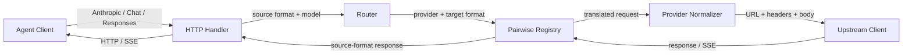

# Agent 與 LLM Provider Pairwise Transform 設計規格

日期：2026-07-16

## 1. 結論

Proxy 保留 `pairwise transform`，不引入 canonical request/response IR。

支援三種 wire format：

- `anthropic-messages`
- `openai-chat`
- `openai-responses`

Registry 必須完整註冊 `3 × 3 = 9` 組 directed pairs。每組 pair 同時負責：

- request：client source format → provider target format
- non-stream response：provider target format → client source format
- stream response：provider target SSE → client source SSE

Provider vendor 與 wire format 分離。同一家 provider 可以支援多個 format，例如 xAI 同時支援 OpenAI Responses 與 Chat Completions，預設優先使用 Responses。

## 2. 目標與範圍 (Goal & Scope)

### 2.1 目標

- 完整實作三種 format 的所有 pairwise combinations。
- 將 routing、credential、HTTP transport、DTO 與 transform 從現有大型 adaptor 拆開。
- 讓新增 provider profile 時優先重用既有 format transforms。
- 讓 request、non-stream response 與 streaming response 的語意一致。
- 明確處理無法轉換的功能，不允許 silent field loss。
- 修正現有 request/response、SSE、timeout、error 與 logging 問題。

### 2.2 不在範圍內

- 不修改 `core.ModelRequest`、`core.ModelResult` 或 runtime provider port。
- 不使用 canonical LLM content IR 取代 pairwise transforms。
- 不新增 Gemini wire format；Google provider 的 native format 留待獨立規格。
- 不改造 admin endpoints、帳務統計或 credential login 流程。
- 不承諾不同 protocol 間能無損 round-trip 所有 provider-specific extensions。

## 3. 現況審查 (Current Review)

現有 `proxy/adaptor/adaptor.go` 同時承擔 model routing、credential refresh、provider URL/header、HTTP transport、request transform、response transform 與 SSE state，職責過多。

現有 `proxy/adaptor/translator.go` 同時放置三種 protocol DTO、雙向 request transforms、non-stream response transforms 與 streaming transforms，已超過一千行，新增組合時容易修改錯誤路徑。

需一併修正的問題：

| 問題                                    | 現況風險                                    | 設計處理                                            |
| --------------------------------------- | ------------------------------------------- | --------------------------------------------------- |
| unknown model 預設 Anthropic            | request 可能送錯 provider                   | 無法唯一解析時回 `400`                              |
| xAI 被視為 Chat-only                    | Responses request 可能被錯送 `/v1/messages` | xAI profile 宣告 Responses + Chat                   |
| token count 固定回 `100`                | 對 client 回傳假資料                        | native count、可信 local counter 或明確 unsupported |
| Responses non-stream 存在 helper stub   | response 不完整                             | 完成正式 pair transform                             |
| `context.Background()` refresh          | client cancel 無法中止 I/O                  | 全程傳遞 request context                            |
| refresh/save/marshal/write error 被忽略 | 失效 token 或 truncated response 被當成功   | 立即 wrap 並回傳 error                              |
| 使用 `http.DefaultClient`               | 缺少明確 timeout policy                     | 注入共用 upstream client                            |
| stream read error 直接 `break`          | 中途斷線被當正常完成                        | 區分 terminal EOF 與 unexpected EOF                 |
| info log 記錄完整 body                  | prompt、tool output 可能外洩                | 只記 metadata，body 僅允許明確 debug-redacted flow  |
| SSE 逐行解析                            | multiline data 與 frame boundary 可能遺失   | 使用完整 SSE frame parser                           |

## 4. 架構 (Architecture)



依賴方向固定：

```text
handler
├── route
├── transform
├── upstream
└── protocol

route      → protocol
transform  → protocol
upstream   → protocol + auth
protocol   → stdlib only
```

`transform` 不得讀 credential、建立 HTTP request 或決定 provider。`upstream` 不得包含跨 protocol 的內容轉換。

## 5. Format 與 Provider 分離

### 5.1 Format

```go
type Format string

const (
 FORMAT_ANTHROPIC_MESSAGES Format = "anthropic-messages"
 FORMAT_OPENAI_CHAT       Format = "openai-chat"
 FORMAT_OPENAI_RESPONSES  Format = "openai-responses"
)
```

### 5.2 Provider profile

```go
type ProviderProfile struct {
 ID        string
 Supported []protocol.Format
 Preferred protocol.Format

 ResolveEndpoint func(protocol.Format) (string, error)
 ApplyAuth       func(*http.Request, *auth.Credential) error
 Normalize       RequestNormalizer
}
```

預設 profiles：

| Profile              | Supported format   | Preferred          | Endpoint                                |
| -------------------- | ------------------ | ------------------ | --------------------------------------- |
| `anthropic`          | Anthropic Messages | Anthropic Messages | `/v1/messages`                          |
| `minimax`            | Anthropic Messages | Anthropic Messages | `/v1/messages`                          |
| `openai-api`         | Responses、Chat    | Responses          | `/v1/responses`、`/v1/chat/completions` |
| `openai-codex-oauth` | Responses          | Responses          | `/codex/responses`                      |
| `xai`                | Responses、Chat    | Responses          | `/v1/responses`、`/v1/chat/completions` |

Provider normalizer 只處理 provider-specific 要求，例如 Codex 的 `store=false`、endpoint、必要 headers，或 xAI format-specific tools。它不負責 Anthropic ↔ OpenAI 的內容語意轉換。Codex `/codex/responses` upstream 固定要求 `stream=true`；若 client 要 non-stream，normalizer 必須標記 `BridgeToNonStream`，handler 將完整 upstream SSE 經 pair stream transform 後收斂成 source-format JSON，不得把 SSE 直接回給 non-stream client。

```go
type NormalizedRequest struct {
 Body              []byte
 UpstreamStream    bool
 BridgeToNonStream bool
}
```

### 5.3 Model routing

Routing 順序固定：

1. 若 model 使用 `<provider>/<model>` qualified form，先解析 provider。
2. 否則查 exact model registry。
3. 為相容既有 client，可使用 anchored provider patterns。
4. 無匹配或同時匹配多家時回 `400 unknown_model`，不得 fallback 到 Anthropic。

Router 輸出：

```go
type Route struct {
 Provider     ProviderProfile
 Model        string
 SourceFormat protocol.Format
 TargetFormat protocol.Format
}
```

## 6. Pairwise Registry

### 6.1 完整矩陣

| Source    | Target    | Request        | Response       |
| --------- | --------- | -------------- | -------------- |
| Anthropic | Anthropic | normalize      | normalize      |
| Anthropic | Chat      | A→Chat         | Chat→A         |
| Anthropic | Responses | A→Responses    | Responses→A    |
| Chat      | Anthropic | Chat→A         | A→Chat         |
| Chat      | Chat      | normalize      | normalize      |
| Chat      | Responses | Chat→Responses | Responses→Chat |
| Responses | Anthropic | Responses→A    | A→Responses    |
| Responses | Chat      | Responses→Chat | Chat→Responses |
| Responses | Responses | normalize      | normalize      |

### 6.2 Contract

```go
type Pair struct {
 From      protocol.Format
 To        protocol.Format
 Request   RequestTransform
 Response  ResponseTransform
 NewStream StreamTransformFactory
}

type RequestTransform func(context.Context, protocol.RequestEnvelope) (protocol.TransformResult, error)
type ResponseTransform func(context.Context, protocol.ResponseEnvelope) (protocol.TransformResult, error)
```

Registry 由 composition root 明確建立，不使用 package `init()` 隱式註冊：

```go
registry, err := transform.NewRegistry(
 transform.AnthropicIdentity(),
 transform.AnthropicToChat(),
 transform.AnthropicToResponses(),
 transform.ChatToAnthropic(),
 transform.ChatIdentity(),
 transform.ChatToResponses(),
 transform.ResponsesToAnthropic(),
 transform.ResponsesToChat(),
 transform.ResponsesIdentity(),
)
```

啟動驗證必須拒絕：

- 重複 `(from, to)` key
- 缺少任一矩陣組合
- nil request transform
- nil non-stream response transform
- nil stream factory

Identity pairs 仍需 decode、validate、model normalization 與 provider normalization，不是無條件 raw passthrough。

## 7. Request Pipeline

```go
type RequestEnvelope struct {
 SourceFormat protocol.Format
 TargetFormat protocol.Format
 Model        string
 Stream       bool
 Headers      http.Header
 Body         []byte
}

type TransformResult struct {
 Body     []byte
 Warnings []Warning
 Losses   []SemanticLoss
}
```

固定流程：

```text
HTTP route 決定 source format
→ 解析 model / stream metadata
→ router 選 provider profile
→ profile 選 target format
→ registry lookup (source, target)
→ request transform
→ provider normalize
→ credential resolve/refresh
→ upstream HTTP request
```

Transform 不得 silent drop 欄位：

| 狀況         | 行為                         |
| ------------ | ---------------------------- |
| 有等價欄位   | 正常轉換                     |
| 可安全降級   | 轉換並記錄 warning/loss      |
| 無法安全表達 | 回 `400 unsupported_feature` |

`Warnings` 與 `Losses` 在本次 exchange 執行期間由 handler 交給 observer，輸出不含 prompt 內容的結構化 log 與 metrics；不額外改寫公開 API response schema。

必要規則：

- Anthropic `tool_use` ↔ Chat `tool_calls` ↔ Responses `function_call`
- Anthropic `tool_result` ↔ Chat `role=tool` ↔ Responses `function_call_output`
- Anthropic thinking budget 可近似成 reasoning effort，但需記錄 semantic loss。
- Chat `developer` role 轉 Anthropic 時合併至 system，保留原始順序。
- Responses `previous_response_id` 在目標不支援 server-side state 且沒有完整 input 時必須拒絕。
- Built-in tool 在目標 provider 不支援時必須回 `unsupported_tool`。

## 8. Response Pipeline

### 8.1 Non-stream

```text
Upstream response
├── 2xx
│   ├── normal JSON → pair response transform target → source
│   └── forced upstream SSE for non-stream client
│       → pair stream transform target → source SSE
│       → source stream collector → source JSON
└── non-2xx
    └── provider error decode → ProxyError → source error encode
```

成功 response 與 error response 不共用 translator。

```go
type Exchange struct {
 OriginalRequest   RequestEnvelope
 TranslatedRequest RequestEnvelope
 ProviderID        string
 NewID             func() string
}

type ResponseEnvelope struct {
 Status  int
 Headers http.Header
 Body    []byte
 Exchange Exchange
}
```

`Exchange` 只保存 reverse transform 與 per-request stream state 所需資料；不直接保存 `route.Route`，避免 `protocol ↔ route` 循環依賴。Production 由 handler 注入 ID generator，測試則注入 deterministic generator。

Response transform 必須保留：

- output text
- reasoning/thinking（目標 source 可表達時）
- tool calls 與 stable call ID
- usage
- finish/stop reason
- source protocol 必要的 response ID、object/type 與 timestamps

### 8.2 Error model

```go
type ProxyError struct {
 Kind              ErrorKind
 Status            int
 Code              string
 Message           string
 RetryAfter        time.Duration
 UpstreamRequestID string
}
```

| 情況                           | HTTP/status 行為                      |
| ------------------------------ | ------------------------------------- |
| client JSON 無效               | `400` source-native error             |
| unknown model/provider         | `400` source-native error             |
| pair 未註冊                    | `422`，不得呼叫 upstream              |
| credential 不存在/refresh 失敗 | `503`                                 |
| upstream transport error       | `502`                                 |
| upstream `4xx/5xx`             | 保留 status，轉 source error envelope |
| upstream `429`                 | 保留 `429` 與 `Retry-After`           |
| timeout                        | `504`                                 |

不得把 credential、authorization header 或未清理的 upstream body放進 client error 或一般 log。

## 9. Streaming 與 SSE

### 9.1 SSE framing

```go
type SSEFrame struct {
 Event       string
 ID          string
 RetryMillis *int
 Comments    []string
 Data        []byte
}
```

Parser 必須以空行作為完整 frame boundary，支援 multiline `data:`、comments 與 CRLF。不得只逐行收到 `data:` 就立刻 transform。

### 9.2 Per-request state

```go
type StreamTransform interface {
 Push(context.Context, protocol.SSEFrame) ([]protocol.SSEFrame, error)
 Close(context.Context) ([]protocol.SSEFrame, error)
}
```

每次 request 建立獨立 state，至少追蹤：

- response/message ID
- message start 是否已送出
- open text/thinking/tool blocks
- upstream item ID ↔ downstream call ID
- tool index 與 partial arguments
- usage
- stop reason
- terminal event 是否已收到

### 9.3 Lifecycle invariants

Anthropic output：

```text
message_start
→ content_block_start
→ content_block_delta*
→ content_block_stop
→ message_delta
→ message_stop
```

OpenAI Chat output：

```text
assistant role delta
→ content/tool_call delta*
→ finish_reason
→ data: [DONE]
```

OpenAI Responses output：

```text
response.created
→ response.in_progress
→ output_item/content_part events
→ delta events
→ output_item/content_part done
→ response.completed
```

### 9.4 Failure semantics

| 狀況                                   | 行為                                     |
| -------------------------------------- | ---------------------------------------- |
| client disconnect                      | cancel upstream context                  |
| upstream error before response headers | 回一般 HTTP error                        |
| upstream error after stream started    | source-native stream error event，再關閉 |
| EOF after terminal event               | success                                  |
| EOF before terminal event              | protocol error，不得假裝 success         |
| malformed SSE frame                    | protocol error，記錄 upstream request ID |

Stream 已開始後的 error frame 固定為：

- Anthropic：`event: error`，body 使用 Anthropic error envelope。
- OpenAI Responses：`event: response.failed`，body 帶 `response.error`。
- OpenAI Chat：送出 `data: {"error": ...}` 後以 `data: [DONE]` 結束。

每個輸出 frame 後 flush，但 writer error 必須立即停止並 cancel upstream。

## 10. Credential、HTTP 與 Headers

- Credential resolve/refresh 使用 request context。
- Refresh 或輪替後的 credential save 失敗時，request 失敗；不得繼續使用無法持久化的新 refresh token。
- 共用 `http.Client` 由 constructor 注入。
- Non-stream 使用整體 timeout；stream 使用 connect/header timeout 與 idle/read policy，不用過短的整體 timeout 中斷長回答。
- Header forwarding 使用 provider profile allowlist。
- `Authorization`、`x-api-key`、`Host` 永不從 downstream client passthrough 至 upstream。
- 保留安全且必要的 request ID、beta/version 與 provider-specific headers。

## 11. Token Counting

`/v1/messages/count_tokens` 不再固定回傳常數。

處理順序：

1. Provider 有 native token-count endpoint 時呼叫 native capability。
2. 有經驗證且與目標 model 相符的 local tokenizer 時使用 local counter。
3. 兩者皆無時回 `501 unsupported_feature`。

不得以未標示的 `chars/4` 或固定數字冒充 provider token count。

## 12. Package Placement

```tree
proxy/
├── server.go
├── handler.go
├── protocol/
│   ├── format.go
│   ├── envelope.go
│   ├── error.go
│   ├── sse.go
│   ├── anthropic/
│   ├── chat/
│   └── responses/
├── transform/
│   ├── registry.go
│   ├── identity.go
│   ├── anthropic_chat.go
│   ├── anthropic_responses.go
│   └── chat_responses.go
├── route/
│   ├── router.go
│   └── profile.go
└── upstream/
    ├── client.go
    ├── credential.go
    └── profile.go
```

三個 cross-format files 各自包含該 unordered format pair 的兩個 directed registrations；若檔案因 streaming state 過大，可在同一 `transform` package 內拆成 request、response 與 stream files，不新增新的架構層。

## 13. Testing

### 13.1 Protocol matrix

| 類型                           | Cases |
| ------------------------------ | ----: |
| Request transforms             |     9 |
| Non-stream response transforms |     9 |
| Streaming response transforms  |     9 |
| 基本 protocol paths            |    27 |

每條 cross-format path 至少覆蓋：

- system/developer instruction
- user/assistant text
- image
- tool definition
- tool call
- partial tool arguments
- tool result
- thinking/reasoning
- token usage
- finish/stop reason

### 13.2 Provider routing matrix

使用 `httptest.Server`，不呼叫真實付費 API：

- `3 agent formats × 5 default provider profiles = 15` cases
- `3 agent formats × xAI forced Chat = 3` cases
- `3 agent formats × OpenAI forced Chat = 3` cases
- 合計 `21` provider routing integration cases

每個 case 驗證 URI、headers、auth、request body、response body 與 source-format error。

### 13.3 Properties

- `Identity stability`：同格式 normalize 不改變語意。
- `Round-trip semantics`：A → B → A 保留共同可表達的語意。
- `Stream equivalence`：合併 stream 後與 non-stream 的 text、tool calls、usage、stop reason 等價。
- `Isolation`：並行 request 的 stream state 不互相污染。
- `Cancellation`：client cancellation 會取消 upstream request。
- `Truncation`：terminal event 前 EOF 必須失敗。

Golden fixtures 放在各 protocol/transform package 的 `testdata/`，來源標示 protocol 與 direction，不把 credential 或真實個人資料放進 fixture。

## 14. 漸進落地 (Incremental Landing)

### Step 1：Contracts 與 Registry

- 新增 format、envelope、error、SSE parser 與 registry。
- 建立 coverage validation tests。
- 舊 adaptor 維持 production path。

驗證：registry 缺一組或重複 key 時 constructor 失敗。

回滾：刪除尚未接線的新 packages。

### Step 2：九組 Request Transforms

- 搬移現有 Anthropic ↔ Chat 邏輯。
- 完成 Anthropic ↔ Responses、Chat ↔ Responses。
- 完成三個 identity normalizers。

驗證：9 request cases + semantic-loss fixtures。

回滾：舊 adaptor 尚未切換。

### Step 3：九組 Non-stream Responses

- 完成成功 response reverse transforms。
- 完成 source-native error encoders。
- 移除設計上的 helper stub；實際舊碼等 cutover 後刪除。

驗證：9 non-stream cases + upstream error table。

回滾：舊 adaptor 尚未切換。

### Step 4：九組 Stream Transforms

- 使用共用 SSE frame parser。
- 為每個 directed pair 建立 per-request state factory。
- 完成 lifecycle、usage、tool argument、unexpected EOF 與 cancellation。

驗證：9 streaming cases + stream equivalence + isolation。

回滾：舊 adaptor 尚未切換。

### Step 5：Provider Profiles 與 Upstream Client

- 建立五個 default profiles。
- xAI 預設改用 Responses，保留 forced Chat route。
- credential refresh 傳遞 context 並處理 save failure。
- 加入 timeout、header allowlist 與 redacted logging。

驗證：provider profile unit tests。

回滾：舊 adaptor 尚未切換。

### Step 6：Handler Cutover

- HTTP handlers 改用 router → registry → upstream pipeline。
- 跑完 21 provider routing integration cases。
- `/models` 由 provider/profile catalog 產生，不保留過時靜態清單。
- token count 改為 capability-based flow。

驗證：root tests、proxy tests、sample modules 與 race-sensitive stream tests。

回滾：單一 commit 還原 handler wiring，transform packages可保留。

### Step 7：Cleanup 與文件同步

- 刪除舊 `proxy/adaptor` 中已被取代的 routing、transport、DTO 與 transforms。
- 更新 `README.md`、`CLAUDE.md` 與 `README.todo`。
- 確認不再有完整 prompt body 的 info logs。

驗證：`go test ./...`、各 workspace module tests、`go vet` 與 docs consistency review。

## 15. 驗收條件 (Acceptance Criteria)

- Registry 在啟動時確認 9 組 pairs 完整且唯一。
- 27 個基本 protocol transform paths 全部通過。
- 21 個 provider routing integration cases 全部通過。
- xAI Responses request 正確送往 `/v1/responses`。
- 所有 stream 都符合 source protocol lifecycle。
- Terminal event 前 unexpected EOF 不得回成功。
- Client cancellation 能中止 upstream I/O。
- 無固定 token count、nil helper stub、unknown-model Anthropic fallback。
- Credential refresh/save、JSON、HTTP、SSE 與 writer errors 不再被忽略。
- 一般 info log 不含完整 prompt、tool result、credential 或 authorization header。
- `core/` 與 runtime provider port 無變更。

## 16. 參考實作取捨

- `tmp/auth2api`：參考 provider profile、Responses/Chat/Anthropic translation 與 streaming state，但不沿用 provider-centric handler 分支。
- `tmp/cliproxyapi/sdk/translator`：參考 format registry、pipeline 與 plugin hooks；本設計保留 explicit pairwise registry，但不使用 global `init()` 隱式註冊。
- 現有 `proxy/adaptor`：現有測試 fixtures 可作為行為基準，但不保留單一大型 adaptor 的職責配置。
