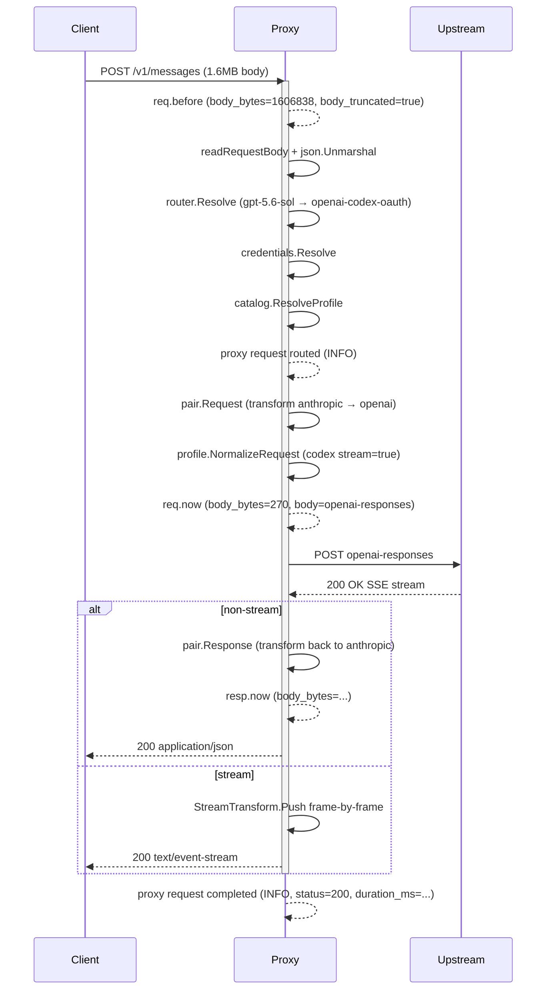
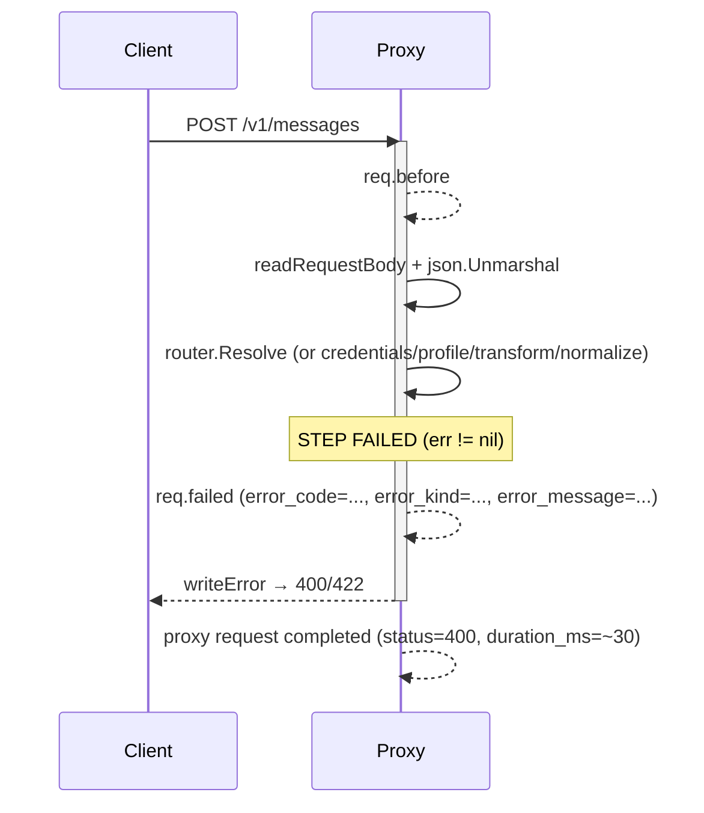
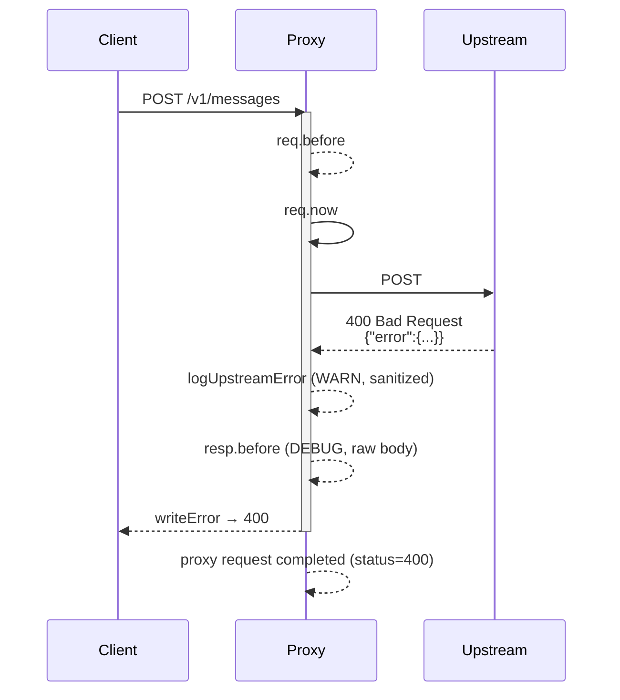

# Debug Payload Chain

`handlers/debug_log.go` 在 `LOG_LEVEL=debug` 下沿 request lifecycle 發出 4 (或 5) 個 structured log records。每一個 record 都是 `slog.LevelDebug` 訊息 `proxy debug payload`，附帶 routing context (`request_id` / `model` / `provider` / `source_format` / `target_format` / `body_bytes` / `body_truncated` / `body`)。

## Chain Overview

```mermaid
flowchart LR
    C[Client<br/>Claude Code / curl] -->|HTTP POST /v1/messages| H[Handler.Handle]

    subgraph REQ[Request Stage]
        H -->|"1. emitDebugPayload<br/>stage=req.before"| RB[(req.before<br/>原始 body)]
        RB --> ROUTER[router.Resolve<br/>credentials.Resolve<br/>catalog.ResolveProfile]
        ROUTER -->|"2. emitDebugPayload<br/>stage=req.now"| RN[(req.now<br/>transform + NormalizeRequest 後)]
    end

    subgraph UP[Upstream Call]
        RN -->|HTTP POST| UP[OpenAI Codex OAuth]
        UP -->|HTTP Response| RT[Response handling<br/>Bridge / Stream / NonStream]
    end

    subgraph RESP[Response Stage]
        RT -->|"3. emitDebugPayload<br/>stage=resp.now<br/>(non-stream only)"| RNO[(resp.now<br/>response transform 後)]
        RT -->|"4. emitDebugPayload<br/>stage=resp.before<br/>(4xx/5xx only)"| RB2[(resp.before<br/>upstream 錯誤 body)]
    end

    RNO -->|HTTP 200 body| C
    RB2 -->|HTTP 4xx/5xx| C

    H -.fail path.->|"5. emitDebugFailure<br/>stage=req.failed"| RF[(req.failed<br/>error_code/kind/message)]
    RF -.writeError.-> C

```

## Stage Catalog

| Stage         | Where (handler.go)                   | When                                                                                 | Body source                                               | Truncation                         |
| ------------- | ------------------------------------ | ------------------------------------------------------------------------------------ | --------------------------------------------------------- | ---------------------------------- |
| `req.before`  | line ~104 (after `json.Unmarshal`)   | Always, after body read + metadata parse                                             | `c.Get("body")`                                           | `DEBUG_PAYLOAD_MAX_BYTES = 64 KiB` |
| `req.now`     | line ~184 (after `NormalizeRequest`) | Only when transform + normalize both succeed                                         | `translated.Body`                                         | 64 KiB                             |
| `resp.before` | `handleUpstreamError` (line ~650)    | Only on 4xx/5xx from upstream                                                        | upstream error body, capped at `MAX_UPSTREAM_ERROR_BYTES` | 64 KiB                             |
| `resp.now`    | `handleNonStream` (line ~487)        | Only on 2xx + non-stream + non-bridge                                                | upstream body, response transform post                    | 64 KiB                             |
| `req.failed`  | every `writeError` site (9 points)   | When any internal step rejects (router/credential/transform/normalization/transport) | original or translated body                               | 64 KiB                             |

## Success Path (200)



## Failure Paths

### Internal failure (transform / normalize / routing) — `req.failed` snapshot



Common `req.failed` shapes seen in production:

| Trigger                                          | `error_code`              | `error_kind`           | Stage failing              |
| ------------------------------------------------ | ------------------------- | ---------------------- | -------------------------- |
| Model not routed                                 | `unknown_model`           | `unknown_model`        | `router.Resolve`           |
| No OAuth credential                              | `auth`                    | `auth`                 | `credentials.Resolve`      |
| Transform pair missing                           | `transform_unavailable`   | `unsupported_feature`  | `registry.Lookup`          |
| Anthropic tool_result with non-text (before fix) | `unsupported_tool_result` | `unsupported_feature`  | `pair.Request`             |
| Codex payload encode fail                        | `protocol_error`          | `protocol`             | `profile.NormalizeRequest` |
| Network / timeout                                | (varies)                  | `upstream` / `timeout` | `client.Do`                |

### Upstream 4xx / 5xx — `resp.before` snapshot



If upstream body > 64 KiB: emits `resp.before` with `body_bytes=0, body_truncated=true` as a summary marker.

## Log Level Gating

The `LOG_LEVEL` env var controls the global slog handler level:

| `LOG_LEVEL`      | What shows                                                                                                                                                                 |
| ---------------- | -------------------------------------------------------------------------------------------------------------------------------------------------------------------------- |
| (unset) / `info` | Only INFO+ records: `proxy request routed`, `proxy request completed`, `proxy transform warning`, `proxy transform semantic loss`, `proxy upstream error` (WARN sanitized) |
| `debug`          | Above + all `proxy debug payload` records (req.before / req.now / resp.before / resp.now / req.failed)                                                                     |

There is **no separate `cfg.Debug` flag** — `LOG_LEVEL=debug` is the single knob. Operationally, run the proxy with:

```bash
LOG_LEVEL=debug go run .
# or
LOG_LEVEL=debug pm2 start ecosystem.config.js
```

## Body Capping

`DEBUG_PAYLOAD_MAX_BYTES = 64 << 10` (64 KiB). Bodies larger than this are truncated; the record still carries `body_bytes` (real size) and `body_truncated=true`. This matches `MAX_UPSTREAM_ERROR_BYTES` for cross-correlation in failure investigation.

## File Reference

- Implementation: `handlers/debug_log.go` (`emitDebugPayload`, `emitDebugFailure`, `truncateBytes`)
- Integration: `handlers/handler.go` (5 emit points), `handlers/handler_upstream_error_test.go`
- Tests: `handlers/debug_log_test.go`
- Stage constants: `debugStageRequestBefore`, `debugStageRequestNow`, `debugStageRequestFailed`, `debugStageResponseBefore`, `debugStageResponseNow`
