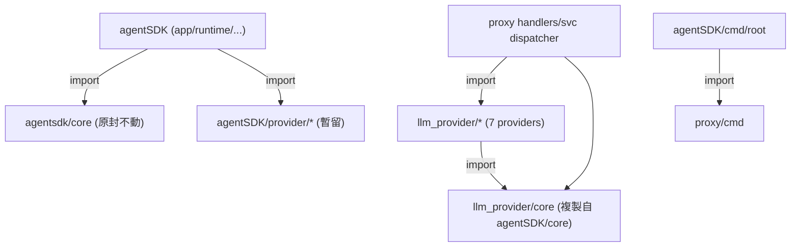

# 抽出 `github.com/bizshuk/llm_provider` 自足共用模組（自帶 core）

## Context

`proxy`（`~/projects/ai/proxy`，module `github.com/bizshuk/proxy`）與 `agentSDK`
（`~/projects/agentSDK`，module `github.com/bizshuk/agentsdk`）各自維護一份 `同源但已漂移`
的 provider 實作（7 家：anthropic / antigravity / codex / google / grok / minimax /
ollama），兩份都依賴 `github.com/bizshuk/agentsdk/core`。

目標：把 provider `下沉為單一框架層模組` `github.com/bizshuk/llm_provider`，用 `go.work`
在本地連結三個 repo。依你的修正，`llm_provider` `自帶一份 core`（複製自 `agentSDK/core`），
`不依賴 agentsdk`，藉此暫時切斷對 agentSDK 的依賴。

真相來源已定：以 `proxy/providers/*` 為準（較新完整：codex `gpt-5.6-*`／預設 `gpt-5.5`、
google 925 行完整 OAuth/stream/validate、minimax `minimax-M2`）。

### 量測依據（決定作用域）

- `agentSDK/core` `自足`：只 import 自己 + `testify`，15 檔 / 1082 行 → 可乾淨複製。
- proxy `只` 依賴 agentsdk 的 `core`（35 處）與 `provider/*`（fork 遺留於測試檔）；
  非 provider 用到 core 的僅 `5 檔`。→ proxy 轉入後可 `完全不再依賴 agentsdk`。
- agentSDK 有 `118 檔` 綁 `agentsdk/core`（整個 SDK 骨幹）→ 無法便宜遷移，`本次不動`。

### 型別身分的取捨（關鍵）

複製 core 後，`llm_provider/core.Provider` 與 `agentsdk/core.Provider` 是 `兩個不同型別`。
故本次作用域採 `proxy 為中心`：
- proxy 全面改用 `llm_provider/core` + `llm_provider/*`，與 `agentsdk` 脫鉤。
- agentSDK 維持用自己的 `core` 與 `provider/`（暫留重複），僅以 go.work 連結供未來遷移。
  agentSDK 未來若要合一，再以 `agentsdk/core` 型別別名（`type X = llmcore.X`）指向
  `llm_provider/core`，屆時 118 檔可零改動 —— 列為後續，不在本計畫。

## 依賴（改動後）



`llm_provider` 只依賴 stdlib + testify；proxy 只依賴 `llm_provider`；agentSDK 不變。
package import graph 無環。

## 執行步驟

### 1. 建立自足模組 `~/projects/llm_provider`

- `go mod init github.com/bizshuk/llm_provider`，`go 1.26.0`
- 複製 `agentSDK/core/*`（含 `*_test.go`）→ `llm_provider/core/`（package 名維持 `core`）
- 複製 `proxy/providers/<name>/` → `llm_provider/<name>/`（每家 provider 為模組根下
  top-level package → import 路徑 `github.com/bizshuk/llm_provider/<name>`）
  - 保留 proxy 未提交的 `providers/codex/options.go`（`gpt-5.5`）一併帶入
- 全面改寫搬入檔的 import：
  - `github.com/bizshuk/agentsdk/core` → `github.com/bizshuk/llm_provider/core`
  - `github.com/bizshuk/agentsdk/provider/<name>`（測試檔遺留）→ `github.com/bizshuk/llm_provider/<name>`
  - `github.com/bizshuk/proxy/providers/<name>`（google 測試遺留）→ `github.com/bizshuk/llm_provider/<name>`
- `go.mod` 只需 `require github.com/stretchr/testify`；`go mod tidy`
- 註：agentSDK google 專屬的 `translate_test.go`、`json_helpers.go` 不在來源(proxy)版內，
  不複製（已知取捨）。

### 2. proxy 轉入並與 agentsdk 脫鉤

- 改 5 個非 provider 檔的 core import（`agentsdk/core` → `llm_provider/core`）：
  `svc/upstream/dispatcher.go`、`dispatcher_default.go`、`dispatcher_oauth.go`、
  `svc/upstream/dispatcher_test.go`、`handlers/handler_dispatcher_test.go`
- dispatcher 內 provider import（`proxy/providers/<name>` 及測試中的 `agentsdk/provider/<name>`）
  → `llm_provider/<name>`
- 刪除 `~/projects/ai/proxy/providers/`
- `proxy/go.mod`：移除 `require`/`replace github.com/bizshuk/agentsdk`（已無 import），
  改 `require github.com/bizshuk/llm_provider`（版本佔位，go.work 覆蓋）
- 新 `proxy/go.work`（proxy `.gitignore` 已含 go.work，真正本地）：
  ```
  go 1.26.0
  use (
      .
      ../../llm_provider
  )
  ```

### 3. go.work 連結 agentSDK（程式碼不動）

- `agentSDK/go.work`（已追蹤檔，新增兩行 use）：
  ```
  use ../llm_provider
  use ../ai/proxy      # 讓 cmd/root 的 proxy/cmd 走本地新版而非過時 pseudo-version
  ```
- agentSDK 的 `core/`、`provider/`、`go.mod`（對 agentsdk/core 的用法）`維持不變`。

## 關鍵檔案

| 檔案 | 動作 |
| --- | --- |
| `~/projects/llm_provider/core/*` (新) | 複製自 agentSDK/core |
| `~/projects/llm_provider/<7 providers>/*` (新) | 複製自 proxy/providers，改 import→llm_provider/core |
| `~/projects/llm_provider/go.mod` (新) | module llm_provider；require testify |
| `proxy/svc/upstream/dispatcher{,_default,_oauth,_test}.go` | core+provider import 改指 llm_provider |
| `proxy/handlers/handler_dispatcher_test.go` | core import 改指 llm_provider |
| `proxy/go.mod` | 移除 agentsdk require/replace；加 llm_provider require |
| `proxy/go.work` (新, gitignored) | use . + ../../llm_provider |
| `proxy/providers/` | 刪除 |
| `agentSDK/go.work` | +use ../llm_provider、../ai/proxy |
| `agentSDK/core`、`agentSDK/provider`、其餘程式碼 | 不動 |

## 驗證

```bash
# 1) 新模組自足可 build + test（無需任何 workspace）
cd ~/projects/llm_provider && go build ./... && go test ./...

# 2) proxy：僅依賴 llm_provider，脫離 agentsdk 後仍綠
cd ~/projects/ai/proxy && go work sync && go build ./... && go vet ./... && go test ./...
#   確認已無 agentsdk：
grep -rn "bizshuk/agentsdk" --include="*.go" . ; echo "expect: 0"

# 3) agentSDK：程式碼未動，go.work 連結本地 proxy/llm_provider 後仍綠
cd ~/projects/agentSDK && go work sync && go build ./... && go test ./...

# 4) 內容抽驗（確認取到 proxy 版）：
grep -rn "gpt-5.6\|gpt-5.5" ~/projects/llm_provider/codex/
ls ~/projects/llm_provider/google/   # 應含 auth_api.go dto.go stream.go validate.go
```

驗證重點：`llm_provider` 三段（自身／proxy／agentSDK）皆 build+test 綠燈；proxy 已 0 筆
`agentsdk` import；llm_provider/codex 仍為 `gpt-5.6`、google 為完整版。

## 風險與備註

- `暫時重複`：agentSDK 仍保有自己的 `provider/` 與 `core`，與 llm_provider 並存。合一
  （agentSDK 改用 llm_provider/core，經型別別名）列為 `後續階段`，本次不做。
- proxy 與 agentsdk `脫鉤`：原本 `proxy → agentsdk`、`agentsdk → proxy` 的模組環被打破，
  改為 `agentSDK → proxy → llm_provider`，較乾淨。
- 跨三 repo 且刪除 `proxy/providers/`，屬預設 `不自動 commit`；驗證後由你決定提交範圍。
- 未提交的 `proxy/providers/codex/options.go`(M) 會被帶入新模組；`tmp/CLIProxyAPI`
  submodule 變更與本任務無關，不動。
```
